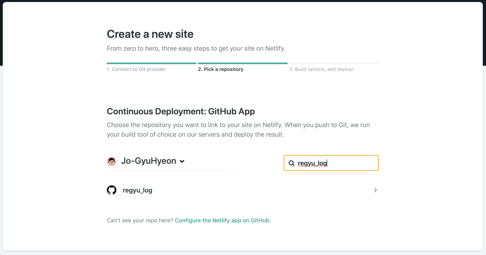
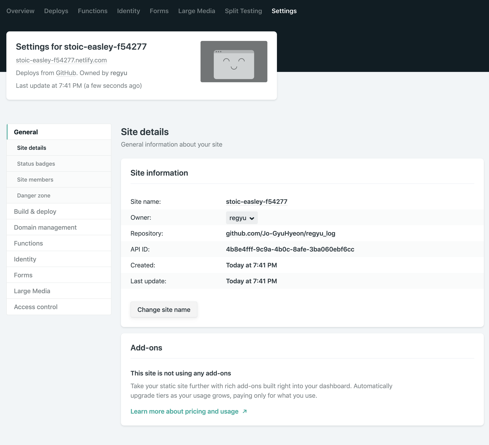
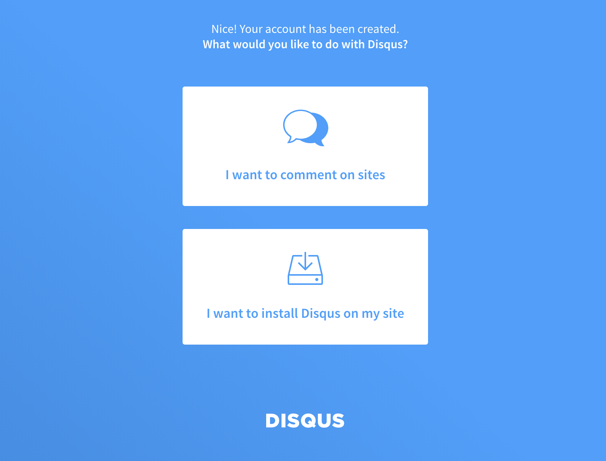
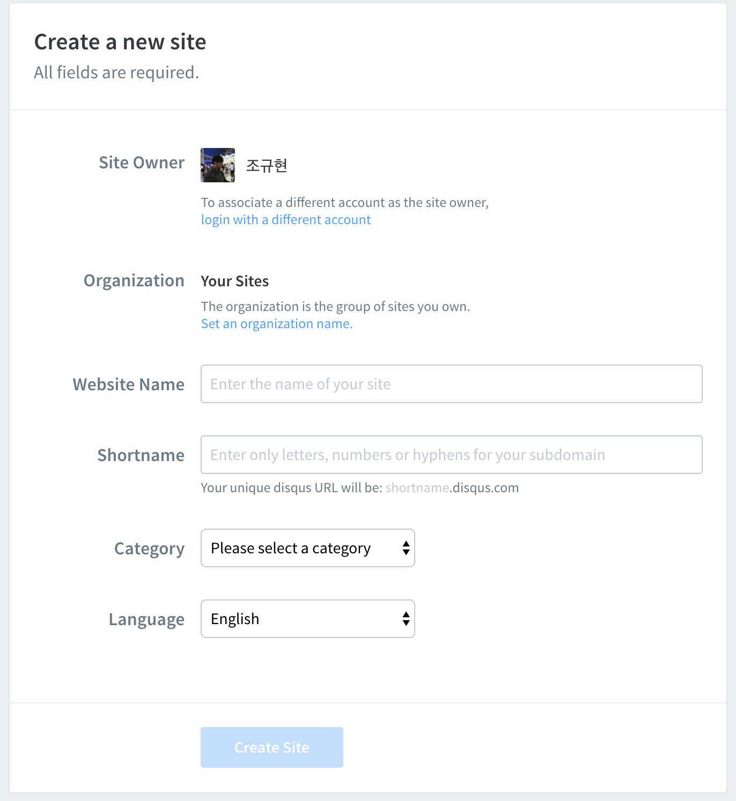
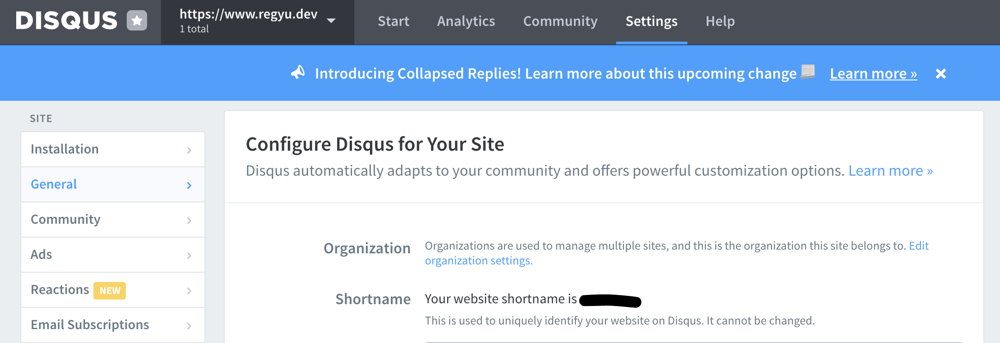

## Gatsby JS 를 선정한 이유

> 결론부터 말하면 Markdwon 을 지원하는 블로그가 필요했다.

공부한 내용을 정리해서 지속적으로 공부의 동기를 가지기 위해 블로그가 필요하다고 생각했고, Tistory 초대장을 받아 블로그 개설을 한 경험이 있었다. 

Tistory 블로그는 여러 개발자 분들이 많이 이용하기도 하였고, 스킨 custom을 할 수 있는 장점이 있었다. 

그당시 공식적?으로 Markdown이 지원되지 않아 스킨 편집으로 markdown.css  파일을 올려 custom 으로 사용해야 됬다.

다른 방법이 있겠지만, 게시물을 올리기 위해서 번거러움이 존재했다.(..핑계)

[티스토리(Tistory) 마크다운(Markdown) 적용](https://regyu.tistory.com/2)

### Gatsby.js 로 만든 블로그 장점

> 기존의 블로그의 단점들이 장점으로 작용되어서 선정되었다.

1. Markdown이 지원할것
2. 사진을 올릴 때 편하게 올릴 수 있을것
    - Typora, Notion에서 내보내기로 바로 편하게 게시 할 수 있다.
3. 필요한 기능 디자인을 수정 할 수 있을 것
    - React를 이용해서 블로그를 만들고 싶은 욕구

## Gatsby js 에 필요한 지식

1. React.js(Node js)
2. Css(scss)
3. Graphql
4. Git

## 테마

> Gatsby.js 홈페이지의 starters에서 테마들을 고를 수 있다.

[Library](https://www.gatsbyjs.org/starters/?v=2)

## 테마 선택

- 각 테마 마다 demo 사이트들이 있다.
- 테마 마다 특징이 다르다.
    - 대부분 plugin 들을 잘 적용해 두었다.(config.js 파일만 수정하면 될정도)
- Source 를 클릭 하면 테마가 있는 Github 페이지로 이동한다.

## 시작

> 선택한 테마의 Source(Github) url 을 복사한다.

    npm i -g gatsby-cli
    gatsby new YOUR_PROJECT_NAME https://github.com/GatsbyCentral/gatsby-v2-starter-lumen

## 배포

> outsider 님의 netlify(네트리파이?) 정리 글을 보고 netilfy를 이용하였다.

[netlify로 정적 사이트 배포하기 :: Outsider's Dev Story](https://blog.outsider.ne.kr/1417)

- 장점
    - 정적 페이지 **무료** 호스팅
    - CI / CD 적용 (private 저장소도 가능)
    - HTTPS 적용
    - 간편한 조작( 클릭 몇번으로 간편하게 세팅)

[Netlify 접속]([https://www.netlify.com/](https://www.netlify.com/))

1. 사이트 추가

    

2. Github 레포 추가

    

3. 빌드 & 배포

    

4. 세팅

    

5. Site setting 
    - site name을 변경하여 domain 변경 가능
    - ex) www.your_site_name.netlify.com

    

6. Domain setting

    

7. 2단계 ( custom domain 추가)
    - Netlify 에서 domain 을 구매 할 수 있다.
    - 다른 곳에서 구입한 domain 을 추가 해도 된다.

    

    > 2단계 (custom domain)이 완료 되면 3단계 (HTTPS)는 자동으로 완료 된다. (단 1시간~24 시간 소요 된다.)

## DISQUS(댓글)

1. Get started
2. I want to install Disqus on my site

    

    

3. Shortname 추가 (shortname은 gatsby 블로그의 config 에서 사용할 예정)

    

4. shortname이 보이지 않을 경우 website name 하단의 customize your url 클릭

5. admin — setting 에서 short name 을 확인 할 수 있다.

6. Gatsby 블로그 프로젝트연동

gatsby-config.js ( 앞으로의 모든 설정은 여기서 할 것이다.)

    module.exports = {
      siteMetadata: {
        url: 'https://www.regyu.dev/',
        title: 'Regyu Dev log',
        subtitle:
          '리규의 흐릿한 잉크 남기기',
        copyright: '© All rights reserved.',
        disqusShortname: 'your disqusShortname' // 이부분 수정
    	}
    }

## Google Analytics

> 티스토리 관리자 페이지 처럼 블로그의 방문자 수, 인기 글을 확인 할 수 있다. - **무료**

1. [Google Analytics]([https://analytics.google.com](https://analytics.google.com/)) 로그인
2. 설정 → 속성 추가 → 추적 코드 

    

3. Gatsby 블로그 프로젝트연동

    gatsby-config.js ( 앞으로의 모든 설정은 여기서 할 것이다.)

        'gatsby-transformer-sharp',
        'gatsby-plugin-sharp',
        {
          resolve: 'gatsby-plugin-google-analytics',
          options: { trackingId: 'YOUR_TRACKINGID' },
        },

## Google 웹마스터 등록 (Search Console)

> 구글 검색 엔진에 검색되기 위해서 필요하다.

1. [Google Search Console]([https://search.google.com/search-console](https://search.google.com/search-console)) 접속
2. 사이트 등록 - URL 접두어 에서 url 입력

    

3. 소유권 확인을 위해 meta 태그 추가

    

    - yourProject→src→components→Layout→index.jsx 의 Helmet태그 안에 입력
    - 각 태마 마다 경로는 다를 수 있지만 대부분 Layout을 담당하는 컴포넌트에 meta 태그를 넣으면 될 것 같다.

    ### Sitemaps & Rss 등록

    > 구글이 크롤링을 잘 하기 위해? Sitemaps과 Rss를 등록 해야 한다.

    Gatsby 테마의 특징을 보면 대부분 sitemaps 와 rss 플러그인을 미리 잘 해두었기 때문에 따로 설정할 필요가 없다. 

    (만약 gatsby-config.js 에서 sitemaps 와 rss에 관련된 플러그인이 적용되지 않았다면 공식문서를 보고 적용해야 한다.)

    

---

## End

여기 까지가 기본적인 세팅이 끝났다. 배포 까지만 해도 되고, 굳이 custom url 까지 적용할 필요는 없다고 생각한다. 필요한 테마를 잘 골라도 되고 custom으로 디자인을 수정하거나 기능을 추가 해도 될 것 같다. 

- TMI
    - 대부분 설정, 메뉴 관리는 gatsby-config.js 에서 다룬다는 것을 까먹지 말자
    - 공식문서를 제대로 읽지 않았었는데 현재 기준으로 v2 는 컴포넌트의 graphql 은 staticQuery 만 지원한다.(변수 사용 X, 역시 공식문서를 잘 읽어 봐야 된다는.....)
    - sample md 파일, gatsby-node.js, gatsby-config.js 위주로 분석하면 (gatsby)프로젝트에 대해 이해하는데 도움이 될 것 같다.

### TLT - Today I Learn

내가 배운 내용을 블로그를 통해 정리하여 글쓰기 연습을 하자.   

### PS

내가 동경하는 개발자들의 블로그를 보면서 대단하다고 생각한다. 좋은 내용을 정리와 이해하기 쉽게 정리하는 것도 대단하지만 꾸준히 작성하는 것에 대하여 대단하다고 생각한다.

언젠간 나도 그들 처럼 되고 싶다 라고 느끼면서 블로그를 다시 시작 해보려고 한다.