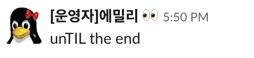
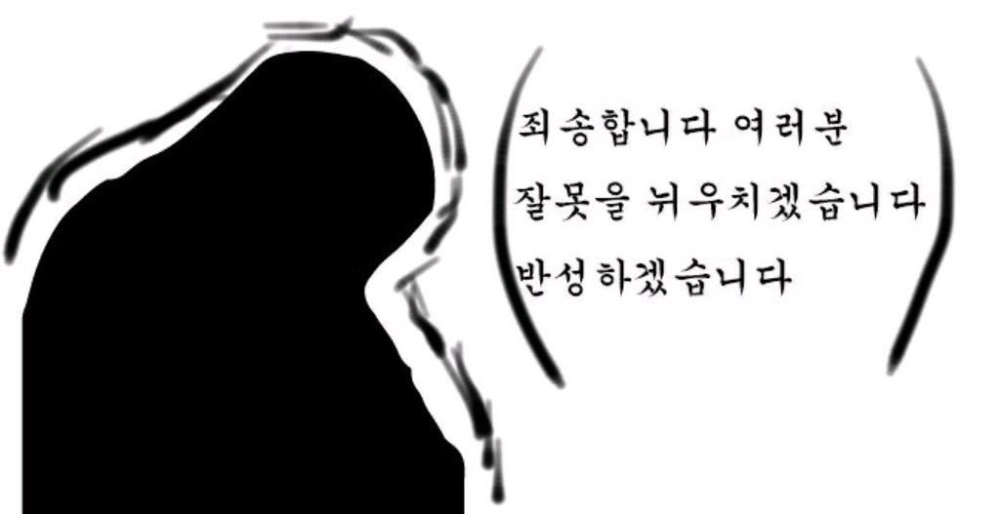

## 다시 시작하는 TIL다짐 - unTIL the end

블로그를 만들고 나서 4월 부터 TIL 시작하기로 생각했었다...

공부 주제도 정하지 않고, TIL 은 주로 Code spitz 영상 내용을 정리하였다. CS 공부도 한다고 했는데 블로그에는 올리지 않았다. (지금까지 한것 보니까 1달 밖에 안했네..)

## 코드리뷰 온라인 스터디 시작

> 프로그래머스에서 운영하는 강의는 내 기억상 인강 같은 강의만 있는 줄 알았는데 코드 리뷰 온라인 강의가 생겼다.

[단순 CRUD는 그만! 웹 백엔드 시스템 구현 온라인 스터디(Java반) 1기 | 프로그래머스](https://programmers.co.kr/learn/courses/9872)

나는 지금까지 코드 리뷰라는 것을 경험 해보지 못하였고, 필요성은 너무나 절실하게 느꼈다. 나도 내 코드가 좋지 않다고 생각하는데, 어떤 부분을 어떻게 고쳐야 될지..조언을 받고 싶었다.

제목 부터 맘에 들었다. 해당 스터디를 하면서 내가 배운 내용을 TIL 게시 글을 올릴려고 했었는데.. 잘 되지 않았다. (핑계..) 

## 5월, 6월 2달간 무엇을 했나?

스터디가 종료 되고 나서 시간이 꽤나 흘렀다.

뭐 그간 놀긴 놀았는데..나름대로 뭐 진행을 하고 있다고 생각 했다. 웹 백엔드 시스템 구현 온라인 스터디가 끝나고나서 배우고 싶었던 Types script 스터디도 하고,

[[온라인 스터디] 2기 대기 중 - 제대로 알고 쓰자! TypeScript: TS를 TS답게 | 프로그래머스](https://programmers.co.kr/learn/courses/9940)

때마침? 그 기간에 여름방학 스타트업 인턴 프로그램인 2019 써머 코딩의 과정들을 진행하였다.

[2019 Summer Coding - 여름방학 스타트업 인턴 프로그램](https://programmers.co.kr/competitions/95/2019-summer-coding)

(할말은 많지만, 생략쓰... 공부 글도 아니니까 간단하게만 기록 하자는 마음 )

## 갑자기 이글을 쓰는 이유는 무엇?

[주니어 성장일기 시리즈: 진주에서 왔다! 웹 백엔드 개발자 꿈나무 이야기](https://prgms.tistory.com/10?fbclid=IwAR30itRAGGU-UyoFBMZWsYiRN-GXliOy8H7M_rugcX9XX85uxpCclVZ8RHs)

웹 백엔드 스터디를 마치고 교육 운영자님이신 에밀리(님 아니고 에밀리)와 인터뷰를 진행하였다. 나의 이야기를 잘 들어 주시고, 나보다 더 잘 표현 해주셨다. 마치 잡지 같은 느낌!

인터뷰를 하고, 게시가 되니까 뭔가 부끄러워 졌다. 누군가 내 블로그를 볼수 있구나..그리고 Java, Spring, 혹은 내가 공부 했고, 다룰 수 있는 기술에 대한 게시글도 없어서도 부끄러웠다.

이전 티스토리 블로그에서도 Spring 공부한 글을 okky나 다른 블로그에서 내 링크가 공유되어서, 부끄럽고 제대로 정리 해야 되겠다는 생각만 들었었는데, 지금은 아무런 글이 없어서 더 부끄럽다.

뭐 남들 보라고 TIL을 하는 건 아니지만, 내 스스로도 다시 정신차려야 될것 같고, 지금까지 너무 논것? 같아서, 밀린 숙제? 공부 했었던 것을 지금이라도 정리 하자 라는 다짐을 하기 위해 이글을 적어 본다. 

앗!! 그리고 교육 운영자님이신 에밀리(님 아니고 에밀리) TIL 제목도 지어 주셨다. 뜻: 인생 끝날때까지 TIL을 쓰겠다

## 마침

> 음..뭔가 프로그래머스를 광고 하는 느낌이 들지만..(아무런 관계가 없다. 프로그래머스 강의를 계속 이용 한 것은 온라인 코드 리뷰 스터디가 재미있어서 계속 하게 되었다.)

다시 맘 잡고 TIL열심히 해야겠다 라는 생각과, 공부한 흔적을 잘 남기자 라는 다짐을 위해서 작성한 글이다.

이글 이후로 스터디(Java Spring, Typescript, Coding Test 대비-Java)에서 공부했던 내용들과, 앞으로  웹 백엔드 개발자가 되기 위해 필요한 공부를 정리 하면서 TIL을 실천 해야겠다.

