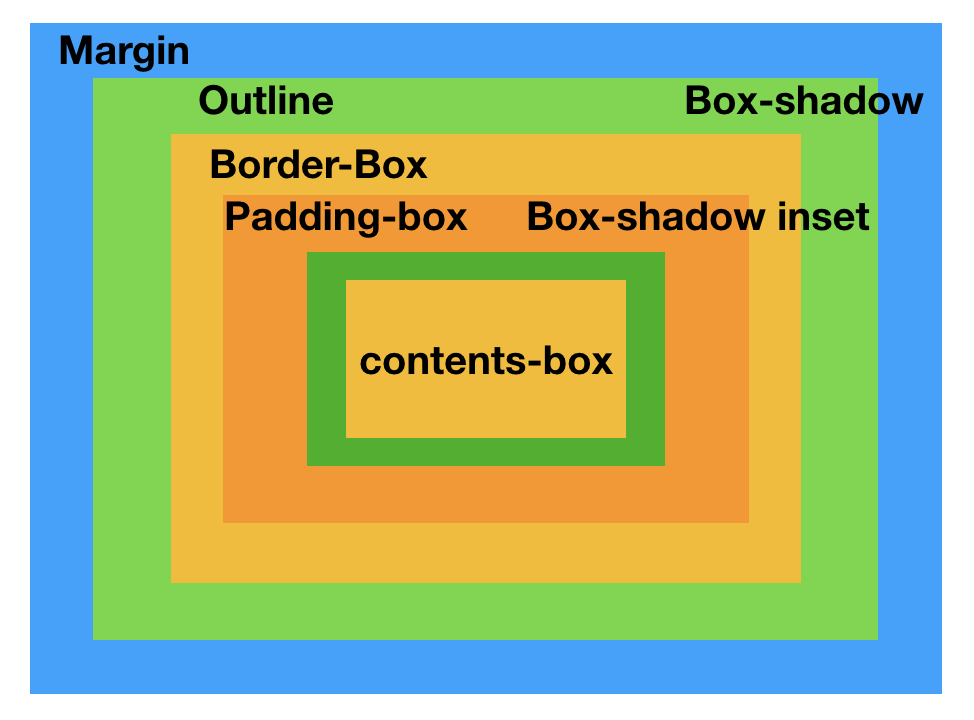
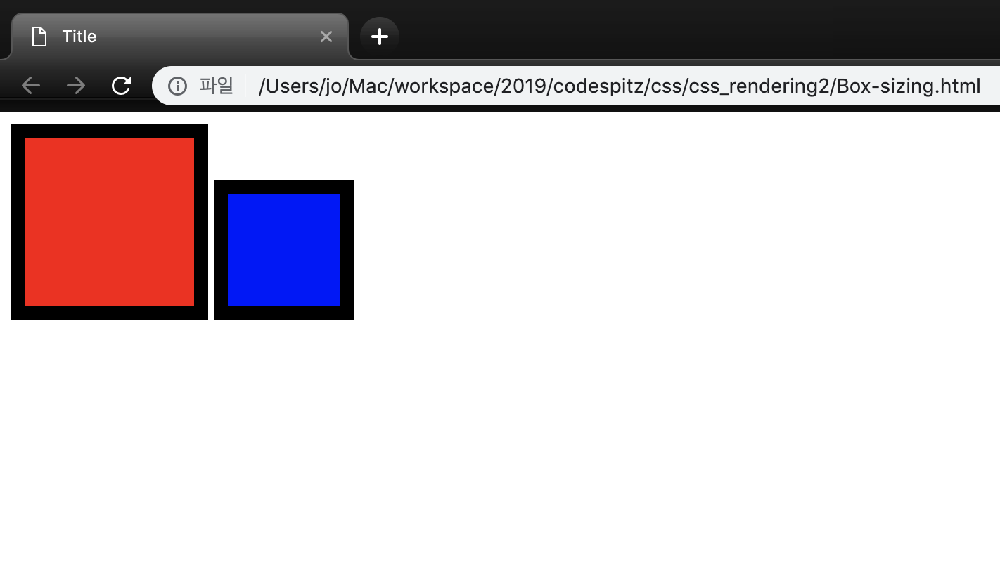
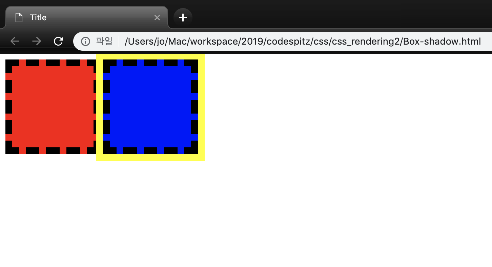
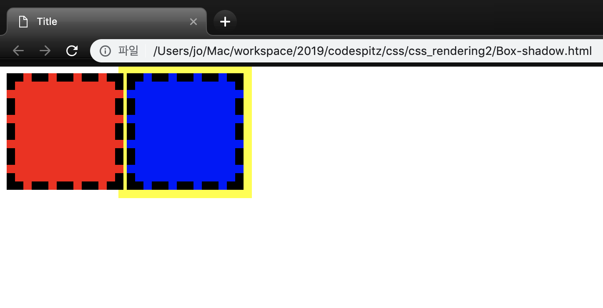
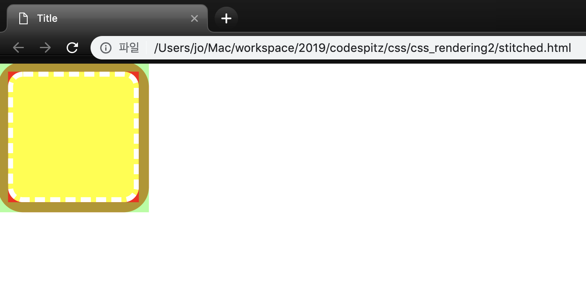

# Morden Box

[코드스피츠](https://www.youtube.com/channel/UCKXBpFPbho1tp-Ntlfc25kA)
채널에서 보고 정리한 글입니다.

---

> Geometry 영향을 끼치지 않는다.

- margin
    - outline ( 박스로 되어 있다. border - radisous 에 영향을 미치지 않는다.)
    - Box-shadow (갯 수 제한이 없다. border - radisous 에 영향을 미친다.)
        - Border-box ( 그림을 그려주는 Fragment는 Border -box 까지이다.)
            - box-shadow inset
            - paddingbox
                - content-box

## Box-sizing

- width, height 를 지정하는 건 content size 이다.

- Box-sizing 을 border-box로 지정하면 width , height 는  테두리 크기까지 포함 한다.

        <!DOCTYPE html>
        <html lang="en">
          <head>
            <meta charset="UTF-8" />
            <title>Title</title>
          </head>
          
          <body>
            

            

          </body>
        </html>

    

## Box-shadow

- Geometry 에 영향을 미치지 않는다.
- 색칠만 하게 된다.
- 그림에 순서에 의해 z-index가 나중에 그려진 것이 올라간다.(Fragment 와 연관있다)

        <!DOCTYPE html>
        <html lang="en">
          <head>
            <meta charset="UTF-8" />
            <title>Title</title>
          </head>
          
          <body>
            

            

          </body>
        </html>

- Position relative 는 Nomal Flow를 그리고 그다음 relative 를 재계산해서 그린다.

        <!DOCTYPE html>
        <html lang="en">
          <head>
            <meta charset="UTF-8" />
            <title>Title</title>
          </head>
          
          <body>
            

            

          </body>
        </html>

## Box-shadow-sandwich

- ,(콤마)로 여러 개 를 그릴 수 있게된다.
- 밖에 부터 그려진다.

        <!DOCTYPE html>
        <html lang="en">
          <head>
            <meta charset="UTF-8" />
            <title>Title</title>
          </head>
          
          <body>
        		

        		

        	</body>
        </html>

    

## stitched

- outline 을 지정하고 안에 마감은 border-radius 로 하는 기법

        <!DOCTYPE html>
        <html lang="en">
          <head>
            <meta charset="UTF-8" />
            <title>Title</title>
          </head>
          
          <body>
            

            

          </body>
        </html>

## Position

static | relative | **absolute** | **Fiexed**

Caret Position & Offset

- Caret Position :
- Offset : Geometry 계산이 끝나서 fix 숫자로 계산된 것 ( 수정이 불가능 하겠지? 참조는 가능)
- frame : 브라우저가 한번의 계산하는 단위(변경해야 되는 요소를 queue 에 flush 하는 행위)
    - offset 을 요청 하면 바로 재 계산이 계속 되어 최적화 룰이 깨진다.

## Offset parent ( 기준점 : Dom 이 아니다)

1. Null
    - Root, Html, Body
    - Position: Fixed
    - Out of Dom Tree
2. Recursive Search
    - Parent Position : Fixed = null
    - Parent Position : !Static = ok ( absolute, relative{ 주로 absolute 의 기준을 잡기 위해 사용})
        - Absoulte
            - offsetParent 무관하게 동상의 (static 이라도)부모 값을 기본적으로 갖고 있다.(default)
            - left,right,top,bottom 속성을 사용하면 더이상 부모 값의 기준이 아니라 offsetParent를 기준으로 삼는다.

                    <!DOCTYPE html>
                    <html lang="en">
                      <head>
                        <meta charset="UTF-8" />
                        <title>Title</title>
                      </head>
                    
                      <body>
                        

                          

                          

                        

                      </body>
                    </html>

        

        - relative{ 주로 absolute 의 기준을 잡기 위해 사용}

                <!DOCTYPE html>
                <html lang="en">
                  <head>
                    <meta charset="UTF-8" />
                    <title>Title</title>
                  </head>
                  
                  <body>
                    

                    

                    

                    

                    

                      

                    

                    

                    

                    

                    

                      

                    

                    

                    

                    

                    

                      

                    

                    

                    

                    

                    

                    

                    

                    

                  </body>
                </html>

        

    - Body = ok
    - TD, TH, Table =ok
    - Parent Parent Coninue

## Position:absolute VS Float = Position:absolute

- Float 는 normal flow 일때만 : (static , relative) new BFC  를 만들어야 하기 때문에