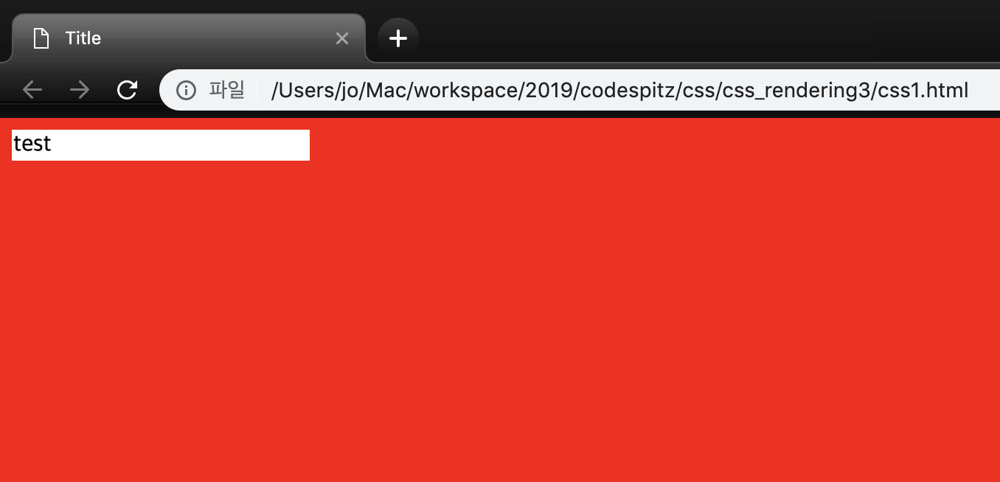

## CSSOM & VENDOR PREFIX

> CSS 객체모델 & 브라우저 접두어   

[코드스피츠](https://www.youtube.com/channel/UCKXBpFPbho1tp-Ntlfc25kA)
채널에서 보고 정리한 글입니다.

---

## Css object model

- Html의 텍스트를 메모리상의 구조로 만드는것은 Css object model 이다.
- Html 의 태크는 일종의 컨터이너 역할이다.
- Style태그의 실체는 Sheet 속성에 있는 cssStyleSheet 객체이다.

        <!DOCTYPE html>
        <html lang="en">
          <head>
            <meta charset="UTF-8" />
            <title>Title</title>
          </head>
        
          
        
          <body>
            
          </body>
        </html>

    

[CSSRule](https://developer.mozilla.org/en-US/docs/Web/API/CSSRule)

  | **Type**                   | **Value** | **Rule-specific interface** |
  | -------------------------- | --------- | --------------------------- |
  | **CSSRule.STYLE_RULE**     | 1         | CSSStyleRule                |
  | **CSSRule.IMPORT_RULE**    | 3         | CSSImportRule               |
  | **CSSRule.MEDIA_RULE**     | 4         | CSSMediaRule                |
  | **CSSRule.FONT_FACE_RULE** | 5         | CSSFontFaceRule             |
  | **CSSRule.PAGE_RULE**      | 6         | CSSPageRule                 |
  | **CSSRule.KEYFRAMES_RULE** | 7         | CSSKeyframesRule            |
  | **...**                    |           |                             |

## Insert Rule

- 동적으로 css 추가 rules에 추가 하는것이 아니라 sheet에 의뢰를 해야된다.(sheet에 추가해달라고 해야한다.)
- style rule은 뒷순서로 적혀있는 것이 우선이 된다.
- styleSheet를 건들이면 inlineTag를 건드리는것보다 훨씬좋다. (일괄 적용이 가능, inlineStyle을 건들이는 것이 아니라 css를 건들이는 것은성능상의 저하가 거의 없다.  돔을 건들이지 않는다.)

        <!DOCTYPE html>
        <html lang="en">
          <head>
            <meta charset="UTF-8" />
            <title>Title</title>
          </head>
        
          
        
          <body>
            
red

            
blue

            
red

            
blue

            
red

            
blue

            
red

            
blue

            
          </body>
        </html
  <video controls autoplay loop>
      <source src="./insertRule.mov" type="video/mp4">
        Your browser does not support the video tag.
  </video>

## Compatibility Library 만들기

- Vendor Prefix
    - Runtime Fetch (**실행 중에 확인해야 한다**.)
- Unsupported Property
    - graceful fail (우아하게 처리)
- Hierarchy Optimize
    - Sheet.disabled=true;

## Classes

- Vendor Prefix
    - Runtime Fetch (**실행 중에 확인해야 한다**.)
    - document body style 에게 물어봐야 한다.

            <!DOCTYPE html>
            <html lang="en">
              <head>
                <meta charset="UTF-8" />
                <title>Title</title>
                
              </head>
            
              
            
              <body>
                
test

            
                
              </body>
            </html>

    

        <!DOCTYPE html>
        <html lang="en">
          <head>
            <meta charset="UTF-8" />
            <title>Title</title>
            
          </head>
        
          
        
          <body>
            
test

        
            
          </body>
        </html>
  <video controls autoplay loop>
      <source src="./keyframe_ex.mov" type="video/mp4">
        Your browser does not support the video tag.
  </video>

## Typed CSSOM

[CSS Typed OM Level 1](https://drafts.css-houdini.org/css-typed-om/)

w3가 아닌데 표준이라고 불린다.

houdin - 구글이 협회를  만들어서 css 요구한 바를 만들어서 draft로 제출한다고 하는 프로젝트이다. (구글은 w3를 싫어 한다..구글은 할 수 있는 것이 많은데 w3로 제한 받는 것을 싫어 하는 것 같다.)

- ~~$('#someDiv').style.height= getRandonInt() + 'px'~~
    - js 애니메이션 프레임워크에서 텍스트를 조립하는 과정이 속도를 저하시킨다.
    - 구글은 이를 싫어 한다.

            CSS.number(0.5)
            el.styleMap.set('opacity', CSS.number(0.5)
            
            CSS.px(500);
            el.styleMap.set('height',CSS.px(500));

[CSS](https://developer.mozilla.org/ko/docs/Web/API/CSS)

    CSS{
    	number, percent
    	em, ex, ch, ic, rem, lg, rlh, vw, vh ....... px
    }