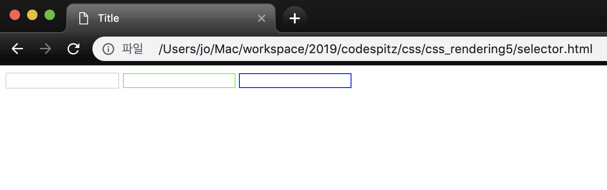

## semantic web & css query
[코드스피츠](https://www.youtube.com/channel/UCKXBpFPbho1tp-Ntlfc25kA)
채널에서 보고 정리한 글입니다.

---

DOM구조를 되도록 이면 의존하지 않는 셀렉터와 CSS의 관리에 대해 알아봅니다.

## semantic web

- DOM : 하나의 문서로서 의미를 갖도록 태깅, (크롤러에게 친화적인 웹, 데이터베이스에 적합한 데이터) 클래스로 의미를 부여하지 말자
- **CSS Selector** : DOM의 구조에 밀접하게 선택
- CSS: 의미와 무관한 스타일

1. DOM을 스타일에 맞춰 제작
2. 태그의 변화가 스타일을 깨먹음

selector는 Class 만 사용한다.

- css attribute selector

    [attr] - 속성이 존재함
    [attr=val] - 값과 일치
    [attr~=val] - 공백으로 구분된 단어로 포함되면 일치
    [attr|=val] - 일치하거나 뒤에 -가 붙을 때
    [attr*=val] - 값이 포함될 때
    [attr^=val] - 값으로 시작할 때 //정규식에도 ^는 시작
    [attr$=val] - 값으로 끝날 때 //정규식에도 &는 마지막
    [(ex) i] - 대소문 구분안 함

SQL = select * from table where field conditions..
CSS Selector = base selector[field conditions][..][..]..

### Scss 문법으로 Selector 사용 예시

[Sass 강좌 - 한 눈에 보기](https://velopert.com/1712)

velopert 님의 sass 강좌를 참고한다.

    //node-sass 글로벌 설치
    npm install -g node-sass
    
    //컴파일하여 현재 디렉토리에 저장
    node-sass selector.scss -o .
    
    //style.scss 파일에 변화가 있을 떄 마다 자동으로 리컴파일
    node-sass selector.scss -w -o .

[CSS: 선택자(Selector) 이해](http://www.nextree.co.kr/p8468/)

이 블로그는 css 선택자의 설명과 함께 그림이 있어 이해하기 편하다.

    <!DOCTYPE html>
    <html lang="en">
      <head>
        <meta charset="UTF-8" />
        <title>Title</title>
      </head>
      <link rel="stylesheet" href="./selector.css" />
      <body>
        <form id="join">
          <input type="text" name="userid" />
          <input type="password" name="pw" />
          <input type="text" name="nick"/>
        </form>
      </body>
    </html>
    
    #join {
      [name="userid"] {
        boder: 1px solid #f00;
      }
      [name="pw"] {
        border: 1px solid #0f0;
      }
      [name="nick"] {
        border: 1px solid #00f;
      }
    }



## HTML5 MicroData

[HTML Microdata](https://www.w3.org/TR/microdata/)

속성을 이용하여 의미론적 으로 html 를 정의하자

- itemscope - 적용범위 설정
- itemtype - 스키마 설정
- itemid - 특정 id부여
- itemprop - 속성명
- content - 비가시적일 때 값을 설정value - 가시적인 값이 원하는 값이 아닐때
- itemref - scope계층구조 안에 없을 때

비교 - 기존 html

    <body>
      <h1>CodeSpitz76 - 5</h1>
      <nav>Home</nav>
      <p>
        코드스피츠76 5회차 수업은 css를 쿼리화하여 사용하는 방법을 다룹니다.
      </p>
      <ul>
        <li>
          <h2>HTML5 MicroData</h2>
          <p>마이크로데이터에 대한 개념과 예제</p>
        </li>
        <li>
          <h2>HTML5 DataSet</h2>
          <p>데이터셋에 대한 개념과 예제</p>
        </li>
      </ul>
      <footer>
        <div>MIT</div>
        <div>Bsidesoft co.</div>
      </footer>
    </body>

비교 - html5 micro data (semantic)

    <!DOCTYPE html>
    <html lang="en">
      <head>
        <meta charset="UTF-8" />
        <title>Title</title>
      </head>
      <link rel="stylesheet" href="./micro.css" />
      <body itemscope itemtype="http://schema.org/WebPage">
        <h1 itemprop="name">CodeSpitz76 - 5</h1>
        <nav itemprop="breadcrumb">Home</nav>
        <p itemprop="description">
          코드스피츠76 5회차 수업은 css를 쿼리화하여 사용하는 방법을 다룹니다.
        </p>
        <ul>
          <li
            itemprop="mainEntity"
            itemscope
            itemtype="http://schema.org/CollegeOrUniversity"
          >
            <h2 itemprop="name">HTML5 MicroData</h2>
            <p itemprop="description">마이크로데이터에 대한 개념과 예제</p>
          </li>
          <li
            itemprop="mainEntity"
            itemscope
            itemtype="http://schema.org/CollegeOrUniversity"
          >
            <h2 itemprop="name">HTML5 DataSet</h2>
            <p itemprop="description">데이터셋에 대한 개념과 예제</p>
          </li>
        </ul>
        <footer>
          <div itemprop="license">MIT</div>
          <div itemprop="publisher">Bsidesoft co.</div>
        </footer>
      </body>
    </html>

태그의 속성으로 의미론 적인 selector를 지정 할 수 있다,

    [itemtype$="WebPage"] {
      [itemprop="name"] {
        font-size: 20px;
        padding: 0;
        margin: 10px 0;
      }
      [itemprop="breadcrumb"] {
        font-size: 11px;
        margin: 0 10px;
        color: #234a7f;
      }
      [itemprop="description"] {
        font-size: 14px;
        line-height: 20px;
        color: #444;
      }
      ul {
        list-style: none;
        padding: 0;
      }
      [itemprop="mainEntity"] {
        padding: 0 20px;
        margin: 10px;
        border: 1px solid #999;
        border-radius: 20px;
      }
      [itemprop="license"] {
        font-size: 11px;
        color: #999;
      }
      [itemprop="publisher"] {
        font-size: 12px;
        font-weight: bold;
        font-family: sans-serif;
      }
    }
    [itemtype$="CollegeOrUniversity"] {
      [itemprop="name"] {
        font-size: 15px;
      }
      [itemprop="description"] {
        font-size: 12px;
        line-height: 15px;
      }
    }
    
    node-sass micro.scss -o .


## HTML5 DataSet

[HTML 5.2](https://www.w3.org/TR/html5/dom.html#dom-dataset)

문법 : data- 가 prefix로 붙는다. 

ex) data-id , data-member-id, data-featue

    <div data-id="hika"></div> 
    <div data-id>hika</div>
    console.log(div.dataset.id); //hika
    
    <div data-id="hika" data-nick="abc"></div>
    <div data-member-id="k0123"></div>
    console.log(div.dataset.memberId); //k0123

Dataset 이 권장하는 바는 의미론 적으로 사용하기 위해 class 를 사용하지 말자

class 와 id 는 의미론 적인 요소가 아닌 디자인을 위해 사용하길 권장 한다.

    <!DOCTYPE html>
    <html lang="en">
      <head>
        <meta charset="UTF-8" />
        <title>Title</title>
      </head>
      <link rel="stylesheet" href="./data-set.css" />
      <body data-type="http://schema.org/WebPage">
        <h1 data-name>CodeSpitz76 - 5</h1>
        <nav data-breadcrumb>Home</nav>
        <p data-description>
          코드스피츠76 5회차 수업은 css를 쿼리화하여 사용하는 방법을 다룹니다.
        </p>
        <ul>
          <li data-mainEntity data-type="http://schema.org/CollegeOrUniversity">
            <h2 data-name>HTML5 MicroData</h2>
            <p data-description>마이크로데이터에 대한 개념과 예제</p>
          </li>
          <li data-mainEntity data-type="http://schema.org/CollegeOrUniversity">
            <h2 data-name>HTML5 DataSet</h2>
            <p data-description>데이터셋에 대한 개념과 예제</p>
          </li>
        </ul>
        <footer>
          <div data-license>MIT</div>
          <div data-publisher>Bsidesoft co.</div>
        </footer>
      </body>
    </html>
    
    [data-type$="WebPage"] {
      color: #900;
      [data-name] {
        font-size: 20px;
        padding: 0;
        margin: 10px 0;
      }
      [data-breadcrumb] {
        font-size: 11px;
        margin: 0 10px;
        color: #234a7f;
      }
      [data-description] {
        font-size: 14px;
        line-height: 20px;
        color: #444;
      }
      ul {
        list-style: none;
        padding: 0;
      }
      [data-mainEntity] {
        padding: 0 20px;
        margin: 10px;
        border: 1px solid #999;
        border-radius: 20px;
      }
      [data-license] {
        font-size: 11px;
        color: #999;
      }
      [data-publisher] {
        font-size: 12px;
        font-weight: bold;
        font-family: sans-serif;
      }
    }
    [data-type$="CollegeOrUniversity"] {
      [data-name] {
        font-size: 15px;
      }
      [data-description] {
        font-size: 12px;
        line-height: 15px;
      }
    }
    
    node-sass data-set.scss -o .


### 출석부 예제

```
<!DOCTYPE html>
<html lang="en">
  <head>
    <meta charset="UTF-8" />
    <title>Title</title>
  </head>
  <link rel="stylesheet" href="./attendance.css" />
  <body>
    <h1 data-name>CodeSpitz72 - member</h1>
    <table>
      <thead>
        <th>번호</th>
        <th>이름</th>
        <th>1강</th>
        <th>2강</th>
        <th>3강</th>
        <th>개근</th>
      </thead>
      <tr data-id="1">
        <td>1</td>
        <td data-name="이도형">이도형</td>
        <td data-1="on">출석</td>
        <td data-2="on">출석</td>
        <td data-3="on">출석</td>
        <td></td>
      </tr>
      <tr data-id="22">
        <td>22</td>
        <td data-name="Suho Lee">Suho Lee</td>
        <td data-1="on">출석</td>
        <td data-2="on">출석</td>
        <td data-3="on">결석</td>
        <td></td>
      </tr>
      <tr data-id="36">
        <td>36</td>
        <td data-name="Beom Yeon Andrew Kim">Beom Yeon Andrew Kim</td>
        <td data-1="on">출석</td>
        <td data-2="off">결석</td>
        <td data-3="off">결석</td>
        <td></td>
      </tr>
      <tr data-id="7">
        <td>7</td>
        <td data-name="HoHoon Lee">HoHoon Lee</td>
        <td data-1="off">결석</td>
        <td data-2="off">결석</td>
        <td data-3="off">결석</td>
        <td></td>
      </tr>
    </table>

    <footer>
      <div data-license>MIT</div>
      <div data-publisher>Bsidesoft co.</div>
    </footer>
  </body>
</html>

[data-1="on"],
[data-2="on"],
[data-3="on"] {
  color: green;
}
[data-1="off"],
[data-2="off"],
[data-3="off"] {
  color: red;
}
[data-1="on"] + [data-2="on"] + [data-3="on"] + td {
  background: green;
}
[data-1="off"] + [data-2="off"] + [data-3="off"] + td {
  background: red;
}
// 1개만 off 인 경우를 만든다.
@for $i from 1 through 3 {
  $ret: "";
  @for $j from 1 through 3 {
    @if $j == $i {
      $ret: $ret + "[data-" + $j + '="on"]';
    } @else {
      $ret: $ret + "[data-" + $j + '="off"]';
    }
    $ret: $ret + "+";
  }
  #{$ret + "td"} {
    background: yellow;
  }
}
```


## 

## Practice

앞의 출석부에서는 하루만 출석한 경우에 노란색이 표시된다. 출석부를 6강까지로 확장하고 다양한 일부만 출석한 모든 경우에 노란색이 잘 표시되도록 SCSS를 작성하시오

    <!DOCTYPE html>
    <html lang="en">
      <head>
        <meta charset="UTF-8" />
        <title>Title</title>
      </head>
      <link rel="stylesheet" href="./practice.css" />
      <body>
        <h1 data-name>CodeSpitz72 - member</h1>
        <table>
          <thead>
            <th>번호</th>
            <th>이름</th>
            <th>1강</th>
            <th>2강</th>
            <th>3강</th>
            <th>4강</th>
            <th>5강</th>
            <th>6강</th>
            <th>개근</th>
          </thead>
          <tr data-id="1">
            <td>1</td>
            <td data-name="이도형">이도형</td>
            <td data-1="on">출석</td>
            <td data-2="on">출석</td>
            <td data-3="on">출석</td>
            <td data-4="on">출석</td>
            <td data-5="on">출석</td>
            <td data-6="on">출석</td>
            <td></td>
          </tr>
          <tr data-id="22">
            <td>22</td>
            <td data-name="Suho Lee">Suho Lee</td>
            <td data-1="on">출석</td>
            <td data-2="on">출석</td>
            <td data-3="on">결석</td>
            <td data-4="on">출석</td>
            <td data-5="on">출석</td>
            <td data-6="on">출석</td>
            <td></td>
          </tr>
          <tr data-id="36">
            <td>36</td>
            <td data-name="Beom Yeon Andrew Kim">Beom Yeon Andrew Kim</td>
            <td data-1="on">출석</td>
            <td data-2="off">결석</td>
            <td data-3="off">결석</td>
            <td data-4="on">출석</td>
            <td data-5="on">출석</td>
            <td data-6="on">출석</td>
            <td></td>
          </tr>
          <tr data-id="7">
            <td>7</td>
            <td data-name="HoHoon Lee">HoHoon Lee</td>
            <td data-1="off">결석</td>
            <td data-2="off">결석</td>
            <td data-3="off">결석</td>
            <td data-4="off">결석</td>
            <td data-5="off">결석</td>
            <td data-6="off">결석</td>
            <td></td>
          </tr>
        </table>
    
        <footer>
          <div data-license>MIT</div>
          <div data-publisher>Bsidesoft co.</div>
        </footer>
      </body>
    </html>

Bit 연산자를 이용하여 모든 조합(경우의 수)를 구할 수 있지만, Sass는 bit 연산자가 없는 것 같아서, 비슷하게 흉내 냈다.

| 2진수 | 10진수 |
| ----- | ------ |
| 0001  | 1      |
| 0010  | 2      |
| 0011  | 3      |
| 0100  | 4      |

    [data-1="on"],
    [data-2="on"],
    [data-3="on"],
    [data-4="on"],
    [data-5="on"],
    [data-6="on"] {
      color: green;
    }
    [data-1="off"],
    [data-2="off"],
    [data-3="off"],
    [data-4="off"],
    [data-5="off"],
    [data-6="off"] {
      color: red;
    }
    [data-1="on"] + [data-2="on"] + [data-3="on"] + [data-4="on"] + [data-5="on"] + [data-6="on"] + td {
      background: green;
    }
    [data-1="off"] + [data-2="off"] + [data-3="off"] + [data-4="off"] + [data-5="off"] + [data-6="off"] + td {
      background: red;
    }
    
    @function pow($base, $exponents) {
      $raised: 1;
    
      @for $i from 1 through $exponents {
        $raised: $raised * $base;
      }
    
      @return $raised;
    }
    
    $data_num: 6;
    
    @for $i from 1 through pow(2, $data_num)-2 {
      $ret: "";
      $binary: $i;
      @for $j from 1 through $data_num {
        @if (floor($binary % 2) ==1) {
          $ret: $ret + "[data-" + $j + '="on"]';
        } @else {
          $ret: $ret + "[data-" + $j + '="off"]';
        }
        $ret: $ret + "+";
        $binary: $binary/2;
      }
      $i: $i * 2;
      #{$ret + "td"} {
        background: yellow;
      }
    }

