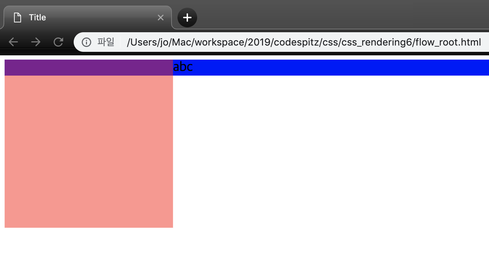
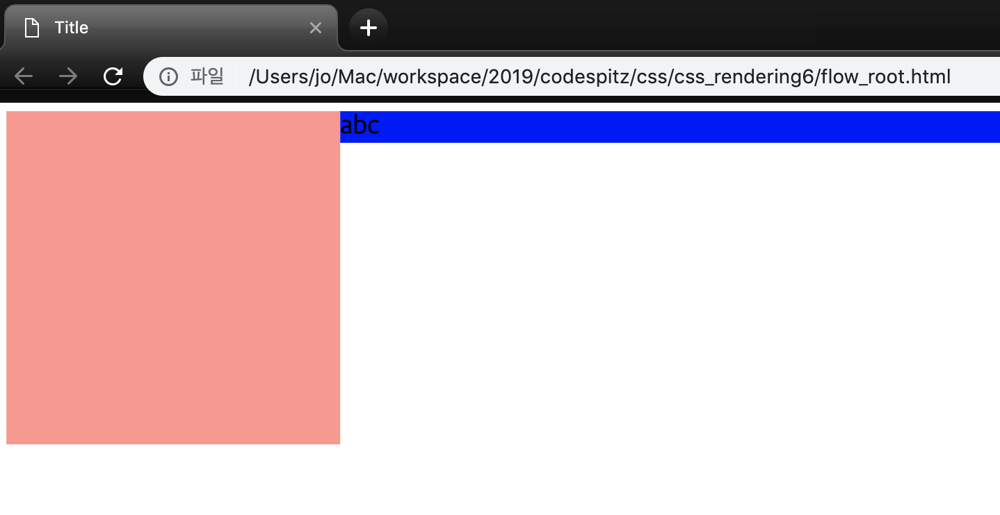
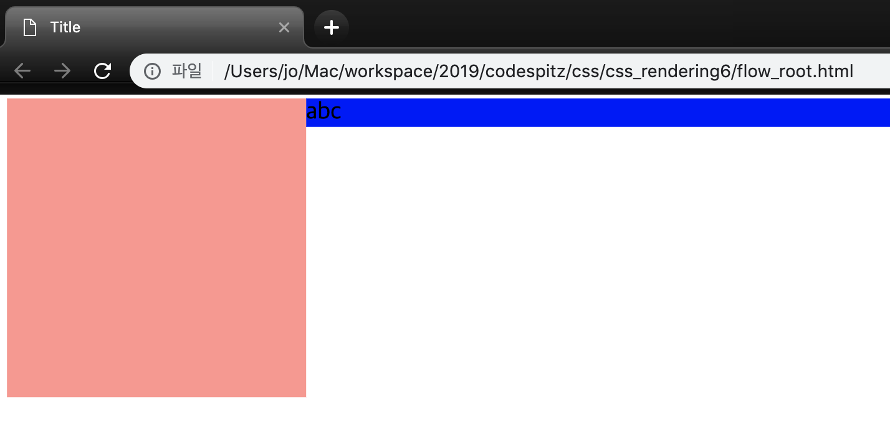
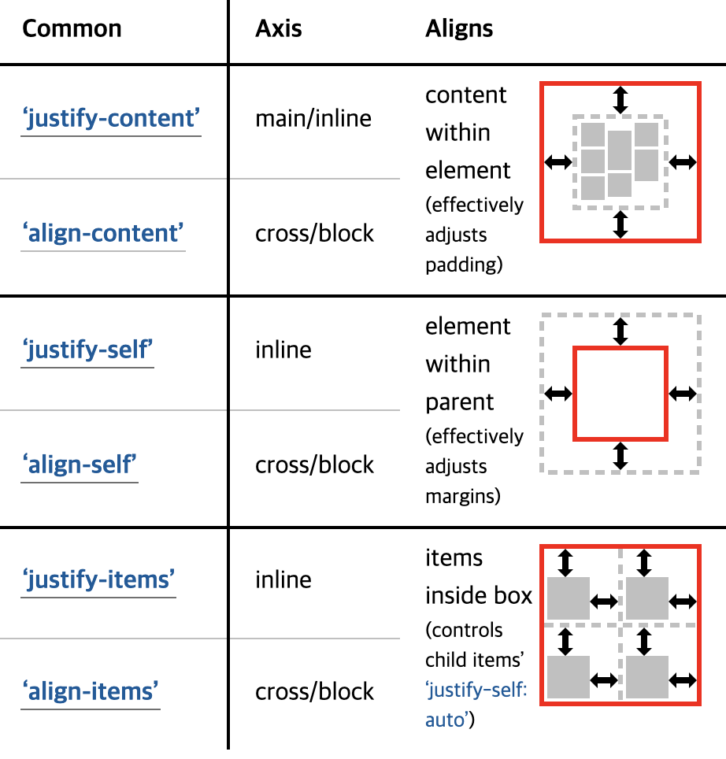
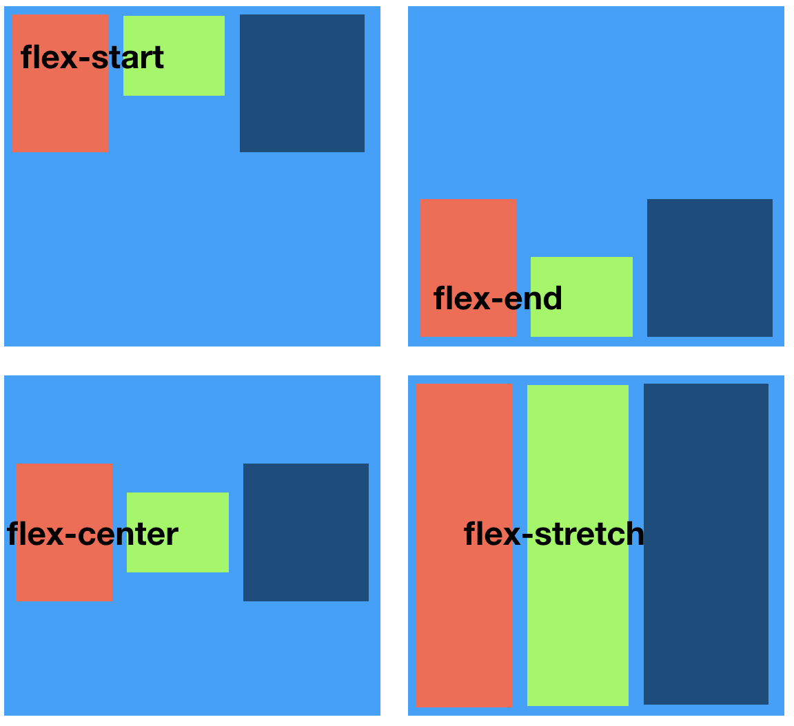

## Display Model
[코드스피츠](https://www.youtube.com/channel/UCKXBpFPbho1tp-Ntlfc25kA)

채널에서 보고 정리한 글입니다.

---

css display module level3

지금 현재 Geometry 를 계산해주는 공식은 display와 position 이다.

## display group

outside | inside | listitem | internal | box | legacy

속성은 geometry를 계산해주는 알고리즘과 같다.

- css 는 오페라 브라우저가 처음으로 제안했다. (이안이스?)

1. outside 
    - nomal flow 와 관련 있다.

        **block | inline | run-in**

2. listitem

    **list-item**

3. box

    br, wbr, meter, progress, canvas, embed, object, audio, iframe, img, video,
    frame, frameset, input, textarea, select, legend, button, details, fieldset

    **contents | none** 

    (box안을 무시하고 그위에 다시 그린다. 대체한다. | 무시)

4. inside

    contents layout 

    (outside와 반대로 안쪽, contents에 관련된 배치)

    **flow | flow-root | table
    flex | grid | subgrid | ruby**

    css 에서 flow가 나오면 nomalflow 말고는 없다고 생각해도 된다.

    float 는 block 요소를 짤라먹지 않고 inline 요소만 guard 한다. (float == 떠있으니까)

        <!DOCTYPE html>
        <html lang="en">
          <head>
            <meta charset="UTF-8" />
            <title>Title</title>
          </head>
        
          <body>
            

            
abc

          </body>
        </html>

    

    새로운 block 요소를 통해서 겹치지 않게 하기 위해서는 overflow 요소를 준다. 

    overflow는 auto가 아닌 이상 새로운 bfc 를 생성한다.

        <!DOCTYPE html>
        <html lang="en">
          <head>
            <meta charset="UTF-8" />
            <title>Title</title>
          </head>
        
          <body>
            

            <!-- 
abc
 -->
            
abc

          </body>
        </html>

    

    flow-root 도  overflow hidden 과 똑같이 적용된다.

    overflow hidden 과 다르게 side effect 없이 새로운 bfc를 만들수 있다. 

    css 2.x 레벨부터 있었던 스펙이다. 

        <!DOCTYPE html>
        <html lang="en">
          <head>
            <meta charset="UTF-8" />
            <title>Title</title>
          </head>
        
          <body>
            

            <!-- 
abc
 -->
            <!-- 
abc
 -->
            
abc

          </body>
        </html>

    

5. legacy

    inline contents layout

    **inline-block | inline-table | inline-flex | inline-grid**

6. internal

    table & ruby

    특정 레이아웃 시스템 안에 들어왔을 때 아이템(자식)이 사용해야 되는 속성들

    **table-row-group | table-header-group | table-footer-group
    table-row | table-cell | table-column-group | table-column
    table-caption
    ruby-base | ruby-text | ruby-base-container | ruby-text-container**

display는 inside 이외에는 확장하지 않는다. internal이 늘어 나지 않는다.

flexbox 나 grid 같은 경우에 별도의 domain 정의한다.

## flexbox

CSS Flexible Box Layout Module

[CSS Box Alignment Module Level 3](https://drafts.csswg.org/css-align/)

draft 역사 -2012년 부터 flex란 이름을 가지게 되었다.

1. Jul 2009 Working Draft (display: box;)
2. Mar 2011 Working Draft (display: flexbox;)
3. Nov 2011 Working Draft (display: flexbox;)
4. Mar 2012 Working Draft (display: flexbox;)Jun **2012** Working Draft (**display: flex;**)
5. Sep 2012 Candidate Recommendation (display: flex;)

flexbox는 직계 자식만 flex-item이다. 

flex-item 은 따로 지정하지 않아도 부모가 display flex 면 모든 직계 자식은 flex-item 이다. 

단 자식의 자식은 상속되지 않는다. 

flexbox는 기본적인 정책은 한 줄만 그리는 정책을 가지고 있다 flex-line. 기본적으로 x 축으로 그린다. 기본축 main-axis . main 축과 직교하는 축을 cross-axis이다.

flexbox 의 작동원리는 DOM rendering 이 아니라 Post Process이기 때문에, 그림을 그리고 GPU에 올리기 때문에 속도가 훨씬더 빠르다. 

DOM 의 구조를 변경하는 것이 아니기 때문에 reflow가 일어 아니지 않는다. (repaint 만 적용된다.)

flex-direction 은  배치를 변경하거나, flex의 기본 축을 변경한다(main-axis 와 cross-axis 를 바꾼다.). 

정렬

justify-content (flex에서만 사용되는 속서이다.) main 축에서만 사용되는 속성이다.) 

cross-axis 는 align-items 속성을 사용한다.

direction에 따라 x축 y 축이 달라진다.

align-self 는 flex-item 들에 대한 정렬을 지정하는 속성이다.

* flex 는 기본적으로 1 line 을 기준으로 적용된다. 

* line 을 여러줄 사용하기 위해서는 flex-wrap 속성을 사용한다.

* flex line을 어떻게 정렬할것인가에 대한 속성은 align-content 가 있다.

* flex wrap 이 있어야 align-content 가 적용된다.

* flex 크기에 대한 옵션 flex-grow | flex-shrnk | flex-basis 가 있다.

  * grow(가중치의 개념이다.) shrnk 0-100% , 1~ , 1 

  * basis 는 기본적으로 auto|content or width,height 기본값은 나의 content 값이다. 따로 width, height를 주면 기본 값은 설정한 값을 준다.

  * flex 는 initial|auto|none|1~ 하나만  지정하는 속성이다.