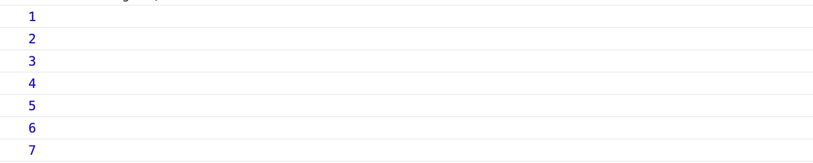
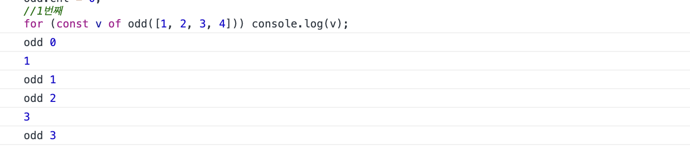
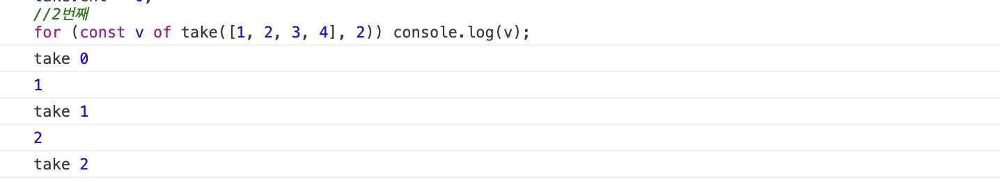

# es6 basic 4
[코드스피츠](https://www.youtube.com/channel/UCKXBpFPbho1tp-Ntlfc25kA)

채널에서 보고 정리한 글입니다.

---

# abstract loop & lazy execution

# abstract loop

iterator 루프의 제어권을 객체로 넘길수 있다.

## complex recursion

단순한 배열을 루프인 경우는 간단히 이터레이션을 작성할 수 있음.

    {
      [Symbol.iterator](){return this;},
      data:[1,2,3,4], 
      next(){
         return {
           done:this.data.length == 0,
           value:this.data.shift()
        }; 
      }
    }

복잡한 다층형 그래프는 어떻게 이터레이션할 것인가?

    {
      [Symbol.iterator](){return this;},
      data:[{a:[1,2,3,4], b:'-'}, [5,6,7], 8, 9], next(){
      return ???; }
    }

    {
      [Symbol.iterator](){return this;},
      data:[{a:[1,2,3,4], b:'-'}, [5,6,7], 8, 9],
      next (){
        let v;
        while(v = this.data.shift()){
          switch(true){
          case Array.isArray(v):
            this.data.unshift(...v);
        break;
        case v && typeof v == 'object':
            for(var k in v) this.data.unshift(v[k]);
            break;
          default:
            return {value:v, done:false};
          }
        }
      return {done:true}; 
      }
    }

es6 로 변경

[//cla](//class)ss Compx {} 는 let 이다.

[[Javascript] typeof 와 instanceof의 차이, 타입 또는 클래스 구분하기](https://unikys.tistory.com/260)

    const Compx = class {
      constructor(data) {
        this.data = data;
      }
      [Symbol.iterator]() {
        const data = JSON.parse(JSON.stringify(this.data));
        //완전한 복사된다. 깊은복사 보다 빠르다 언어의 c 가 처리한다.
        return {
          next() {
            let v;
            while ((v = data.shift())) {
              if (!v && !(v instanceof Object)) return { value: v };
              if (!Array.isArray(v)) v = Object.values(v);
              data.unshift(...v);
            }
            return { done: true };
          }
        };
      }
    };
    const a = new Compx([{ a: [1, 2, 3, 4], b: '-' }, [5, 6, 7], 8, 9]);
    console.log([...a]);
    console.log([...a]);

    const Compx = class {
      constructor(data) {
        this.data = data;
      }
      *gene() {
        const data = JSON.parse(JSON.stringify(this.data));
        let v;
        while ((v = data.shift())) {
          if (!v && !(v instanceof Object)) yield v;
          else {
            if (!Array.isArray(v)) v = Object.values(v);
            data.unshift(...v);
          }
        }
      }
    };
    const a = new Compx([{ a: [1, 2, 3, 4], b: '-' }, [5, 6, 7], 8, 9]);
    console.log([...a.gene()]);
    console.log([...a.gene()]);

# abstract loop

다양한구조의루프와무관하게해당값이나상황의개입만하고싶은경우

    (data, f) => {
      let v;
      while ((v = data.shift())) {
        if (!(v instanceof Object)) f(v);
        else {
          if (!Array.isArray(v)) v = Object.values(v);
          data.unshift(...v);
        }
      }
    };

제어문을 재활용할 수 없으므로 중복정의할 수 밖에 없다.

    (data, f) => {
      let v;
      while ((v = data.shift())) {
        values(v);
        if (!(v instanceof Object)) {
          //v로 뭔가 하는 부분
          console.log(v); //console 추가
          f(v);
        } else {
          if (!Array.isArray(v)) v = Object.values(v);
          data.unshift(...v);
        }
      }
    };

결국 제어문을 직접 사용할 수 없고 구조객체를 이용해 루프실행기를 별도로 구현

    (data, f) => {
      let v;
      //루프 공통 골격
      while ((v = data.shift())) {
        if (!(v instanceof Object)) {
          //개발 구조 객체
          f(v);
        } else {
          //개발 구조 객체
          if (!Array.isArray(v)) v = Object.values(v);
          data.unshift(...v);
        }
      }
    };

팩토리 + 컴포지트

    const Operator = class {
      static factory(v) {
        if (v instanceof Object) {
          if (!Array.isArray(v)) v = Object.values(v);
          return new ArrayOp(v.map(v => Operator.factory(v)));
        } else return new PrimaOp(v);
      }
      constructor(v) {
        this.v = v;
      }
      operation(f) {
        throw 'override';
      }
    };
    const PrimaOp = class extends Operator {
      constructor(v) {
        super(v);
      }
      operation(f) {
        f(this.v);
      }
    };
    const ArrayOp = class extends Operator {
      constructor(v) {
        super(v);
      }
      operation(f) {
        for (const v of this.v) v.operation(f);
      }
    };
    Operator.factory([1, 2, 3, { a: 4, b: 5 }, 6, 7]).operation(console.log);

팩토리 + 컴포지트 + ES6 Iterable

[generator yield*](https://bblog.tistory.com/313)

[yield from - 다른 제너레이터에게 작업을 위임하기 · Wireframe](https://soooprmx.com/archives/8679)

    const Operator = class {
      static factory(v) {
        if (v instanceof Object) {
          if (!Array.isArray(v)) v = Object.values(v);
          return new ArrayOp(v.map(v => Operator.factory(v)));
        } else return new PrimaOp(v);
      }
      constructor(v) {
        this.v = v;
      }
      *gene() {
        throw 'override';
      }
    };
    const PrimaOp = class extends Operator {
      constructor(v) {
        super(v);
      }
      *gene() {
        yield this.v;
      }
    };
    const ArrayOp = class extends Operator {
      constructor(v) {
        super(v);
      }
      *gene() {
        for (const v of this.v) yield* v.gene();
        //yield* v.gene() (위임 yield 설명)
        // yield는 내것을 반환하고 중지한다.
        // yield* v.gene() 모든 것들을 yield처리 하고 문이 넘어간다
      }
    };
    for (const v of Operator.factory([1, 2, 3, { a: 4, b: 5 }, 6, 7]).gene())
      console.log(v);

## lazy execution

## yield

    const odd = function*(data) {
      for (const v of data) {
        console.log('odd', odd.cnt++);
        if (v % 2) yield v;
      }
    };
    odd.cnt = 0;
    //1번째
    console.log('-----------------1번째-----------------');
    for (const v of odd([1, 2, 3, 4])) console.log(v);
    
    const take = function*(data, n) {
      for (const v of data) {
        console.log('take', take.cnt++);
        if (n--) yield v;
        else break;
      }
    };
    take.cnt = 0;
    //2번째
    console.log('-----------------2번째-----------------');
    for (const v of take([1, 2, 3, 4], 2)) console.log(v);
    
    odd.cnt = 0;
    take.cnt = 0;
    //3번째
    console.log('-----------------3번째-----------------');
    for (const v of take(odd([1, 2, 3, 4, 5, 6, 7, 8, 9, 10]), 2)) console.log(v);

1. 결과

    

2. 결과

    

3. 결과 

    (yield 체인의 결과가 효율이 높다.)

    코루틴의 서스팬션을 이용한 경우

    

## yield*

    const Stream = class {
      static get(v) {
        return new Stream(v);
      }
      constructor(v) {
        this.v = v;
        this.filters = [];
      }
      add(gene, ...arg) {
        this.filters.push(v => gene(v, ...arg));
        return this;
      }
      *gene() {
        let v = this.v;
        for (const f of this.filters) v = f(v);
        yield* v;
      }
    };
    
    const odd = function*(data) {
      for (const v of data) if (v % 2) yield v;
    };
    const take = function*(data, n) {
      for (const v of data)
        if (n--) yield v;
        else break;
    };
    for (const v of Stream.get([1, 2, 3, 4])
      .add(odd)
      .add(take, 2) //커링
      .gene())
      console.log(v);

[커링 함수 (Curring function)](https://webclub.tistory.com/6?category=501390)