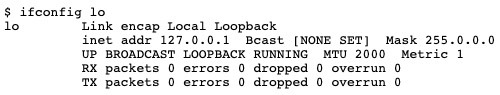

사건은 이러하다. 

1. 잘 되던 블로그에 댓글 기능을 추가하려고 플러그인을 설치했다.
2. 생각보다 진행이 잘 안되서 플러그인 삭제
3. 블로그가 실행이 안됨
4. node랑 react는 내가 아는 영역이 아니라 그냥 다시 설치하자는 마음으로 노드를 완벽삭제
5. 재설치 후 `yarn develop`을 하면 `localhost:8000`으로 로컬서버를 띄우게 되는데 계속 refresh
6. 역시 갓구글 검색. 검색어: `run yarn develop in gatsby and constant refresh page`
7. 나와 동일한 [이슈](https://github.com/gatsbyjs/gatsby/issues/18226)를 만난 사람이 있었음.
8. 그 중 어느 한 사람이 자신도 동일한 이슈를 겪었으며, 가상 윈도우에서 동일한 페이지를 열면 문제가 없다고 이야기함.
9. 그래서 어떤 사람이 방법을 제시함
10. To use `http://127.0.0.1:8000` instead of `http://localhost:8000`.

##What is the difference between 127.0.0.1 and localhost?

###1. Basic knowledge

Even when every network device is disconnected, your computer can still
communicate over a kind of network. Known as a “loopback,” a Unix machine
can send and receive network communications from itself and to itself over a
virtual network device. Your computer can send messages from itself to itself,
permitting network-style communications without the need for a functioning network.

> 모든 통신 장비가 분리되어도 컴퓨터는 여전히 네트워크를 통해서 통신할 수 있다.
> `loopback`이라고 불리는 유닉스 기계는 가상 네트워크 장비를 통해서 자신이 자신에게
> 네트워크통신을 주고 받을 수 있다. 컴퓨터는 기능을 수행하는 네트워크 없이 `network-
> style` 통신을 허락한다면 메세지를 자기자신에게 보낼 수 있다.

###2. What is 127.0.0.1?
127.0.0.1 is the most commonly-used loopback IP address. It’s part of the
reserved block of more than sixteen million IP addresses that are used
specifically for loopback functionality. A loopback allows your computer to
communicate with itself while using networking connection protocols.

> 127.0.0.1은 일반적으로 사용되는 루프백 IP 주소이다. 그것은 루프백 기능에 특별히
> 사용되는 1600만개의 IP 주소를 대신하는 블록의 일부분이다. 루프백은 컴퓨터가 네트워크
> 통신 프로토콜을 사용하는 동안 자신과 통신할 수 있게 해준다.

In broad abstraction, a loopback is a virtual networking device that creates
a network connection with only one endpoint, meaning that it begins and ends
at the same device:your computer. In fact, the loopback device even shows up
in ipconfig with the name lo, as seen above. The loopback addresses are
primarily used for troubleshooting (it’s similar to looking in a mirror) or
to access local resources over a network interface.

> 넓은 추상화에서 루프백은 하나의 엔드포인트로만 네트워크 연결을 만드는 가상 네트워크
> 장치로, 당신의 컴퓨터처럼 하나의 장비 안에서 시작하고 종료된다는 것을 의미한다.
> 실제로 루프백 장치는 위에서 보여지는 것처럼 `lo`라는 이름을 가진 `ipconfig`안에서 나타나기도
> 한다. 루프백 주소는 주로 문제해결(거을 안을 보는 것처럼)을 위해 사용되거나 로컬 리소스를
> 네트워크에 띄워서 확인하는 데 사용된다.

###3. What is localhost?
“localhost” describes a communication port that connects to the originating
server. It allows a network connection to “loop back” on itself, permitting you
to emulate network connections when no such network is present or available.
In practice, localhost is treated as synonymous with 127.0.0.1 for usage and
discussion. However, it’s important to remember that they are not strictly
identical.

> `localhost`는 원래서버와 통신하는 통신 포트로 설명됩니다. 로컬호스트는 네트워크
> 연결이 스스로 "loop back"을 할 수 있도록 하고, 네트워크가 없거나 사용 가능할 때 네트워크
> 통신이 동작하는 것처럼 해줍니다. 실제로 `localhost`는 이야기 하거나 사용할 때에
> `127.0.0.1`과 동의어로 사용합니다. 그러나 그 둘은 엄격히 다르다는 것을
> 기억해야 합니다.

Before making a DNS request to translate the text string typed by the user into
a navigable IP address, the operating system checks the HOSTS file for any
aliases or redirect rules. On a system configured to standard defaults,
“localhost” in a URI will resolve to 127.0.0.1 under IPv4 or ::1 for IPv6. There are
far more loopback addresses than just those two, however. The block of IP
addresses reserved for loopback addresses stretches from 127.0.0.0 to
127.255.255.255.

> 사용자가 입력한 문자열을 탐색가능한 IP주소로 변경하는 DNS 요청을 하기 전에는,
> 운영체제가 HOSTS 파일에서 any aliases or redirect rules를 검사했다. 기본값으로 설계된
> 시스템에서는 URL의 "localhost"는 IP4에서는 127.0.0.1로, IP6에서는 ::1로 해결된다.
> 하지만 이 두개의 루프백 주소보다 더 많은 루프백 주소가 존재한다. 루브백을 위해 준비된 IP
> 주소의 일부는 127.0.0.1부터 127.255.255.255로 확장된다.

In most all cases localhost will resolve to 127.0.0.1, thanks to a redirect rule in
the HOSTS file, as mentioned above. But in some cases, localhost may be
mapped to a different IP address. So, localhost could be pointed to any IP
address in that block, and it would function identically.

> 대부분의 경우에 로컬호스는 위에서 이야기한대로 HOSTS 파일의 redirect rules 덕분에
> 127.0.0.1로 해결된다. 그러나 경우에 따라서는, localhost는 다른 IP주소와 매칭될 수
> 있다. 그래서 localhost는 어떤 IP주소를 가리키기도 하고, 동일하게 동작할 수 있다.

###4. Conclusion: What’s the Difference Between localhost and 127.0.0.1?

On most machines localhost and 127.0.0.1 are functionally identical. But
localhost is a label for the IP address and not the address itself. Localhost
could be pointed at different IP addresses. In fact, it could be pointed at any IP
address, even one outside the reserved address block. The HOSTS file doesn’t
care and won’t stop you. However, it will break significant functionality on
your system and crash any app that relies on a localhost connection.

> 대부분의 시스템에서 localhost와 127.0.0.1은 기능적으로 동일하다. 그러나 localhost는
> IP 주소의 일부를 나타내는 정도이지 주소자체는 아니다. localhost는 다른 주소를 가리킬
> 수 있다. 실제로, 그것은 준비된 주소 블록 밖에 있는 다른 주소를 가리킬 수 있다. HOSTS
> 파일은 이런 현상들을 확인해주거나 멈추어주지 않는다. 그러나 잘못된 연결은 시스템의 중요한
> 기능을 손상시키고 localhost 연결에 의존성이 있는 다른 모든 앱과 충돌이 발생할 것이다.

The 127 block of addresses was chosen for the loopback address block
because it was the last block of Class A addresses, which run from the binary
address value 00000001 to 01111111. In IPv6, the loopback address is the first
address, 0:0:0:0:0:0:0:1, most frequently expressed in its truncated form as ::1.

> 주소들이 뭉쳐진 127 블록은 2진수 주소 값 00000001에서 01111111까지 실행되는
> Class A 주소들이 뭉쳐진 마지막 블록이기때문에 loopback 주소 블록으로 선택되었다.
> IPv6에서 루프백 주소는 첫번째 주소인 0:0:0:0:0:0:0:1인데, 주로 ::1로 줄여서 표현된다.

정리하자면 루프백은 자기자신과 통신할 수 있는 유닉스 장치입니다. 127.0.0.1은 그러한
루프백의 IP주소입니다. 로컬호스트는 컴퓨터 스스로가 루프백을 할 수 있도록 도와줍니다.
두 개는기능적으로는 동일하지만 localhost에서 DNS를 통한 request가 다른 블록을 가리게 되는 경우가 생깁니다.
 
제게 발생한 문제도 동일한 경우가 아닐까 싶습니다. 지금 해보니 또
localhost:8000으로 문제 없이 동작하네요.

ref: [https://github.com/gatsbyjs/gatsby/issues/18226](https://github.com/gatsbyjs/gatsby/issues/18226) 
ref: [https://www.maketecheasier.com/localhost-and-127-0-0-1/](https://www.maketecheasier.com/localhost-and-127-0-0-1/)
