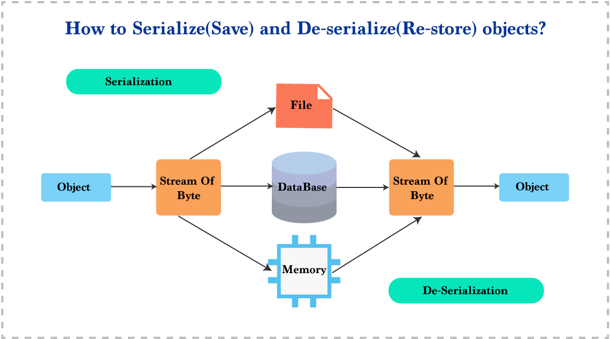

### 데이터 직렬화

**위키에서 설명하는 직렬화는 아래와 같습니다.**
> 직렬화 또는 시리얼라이제이션(serialization)은 컴퓨터 과학의 데이터 스토리지 문맥에서 데이터 구조나 오브젝트 상태를 동일하거나 다른 컴퓨터 환경에 저장(이를테면 파일이나 메모리 버퍼에서, 또는 네트워크 연결 링크 간 전송)하고 나중에 재구성할 수 있는 포맷으로 변환하는 과정이다. 
반대로, 일련의 바이트로부터 데이터 구조를 추출하는 일은 역직렬화 또는 디시리얼라이제이션(deserialization)이라고 한다.

PC-**A**에서 구조체 데이터를 인터넷 너머에 있는 PC-**B**로 보낸다고 가정해봅시다. 네트워크 데이터는 연속된 바이트의 흐름일 뿐입니다. 따라서 구조체를 바이트 배열로 만들어야하는데, 이를 직렬화라고 합니다. 직선으로 쭉 나열한다 라는 의미로 보면 됩니다. 직렬화된 데이터를 받는 측에서는 사용하기 위해서 다시 구조체를 만들어야합니다. 이를 역직렬화라고 합니다. 
 
데이터를 직렬화 하고 역직렬화 하려면, 데이터 포맷을 알고 있어야 합니다. JSON, XML, YAML과 같은 문서 포맷이 주로 직렬화의 대상이 됩니다. 
 
IP, TCP, UDP는 네트워크를 가로지르는 메세지들의 데이터 타입이나, 의미를 찾을 수가 없습니다. 그저 단순한 바이트의 흐름으로 볼 뿐입니다. 따라서 응용 프로그램들은 바이트 흐름을 판독에 적합한 데이터로 `직렬화`하고, 반대로 바이트의 흐름으로 만들어주는 `비직렬화` 작업을 수행해야합니다. 
 
직렬화 되는 방법과 비직렬화 되는 방법이 `동일`해야 다른 환경과 데이터를 주고 받을 수 있습니다.
