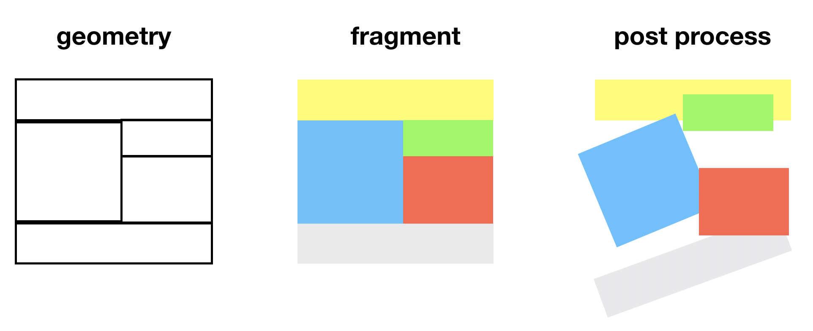
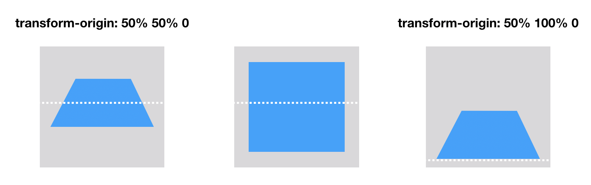
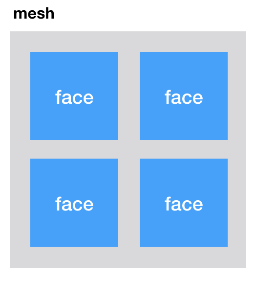
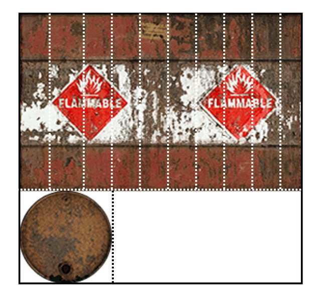
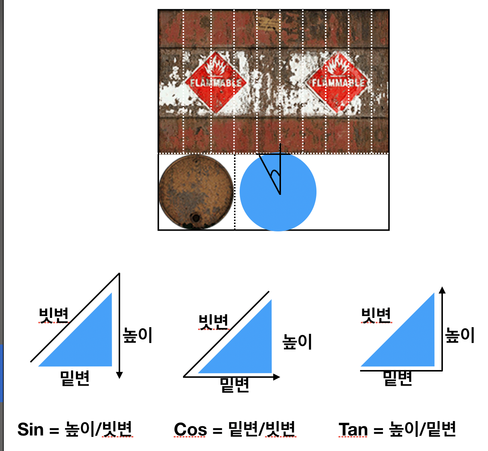
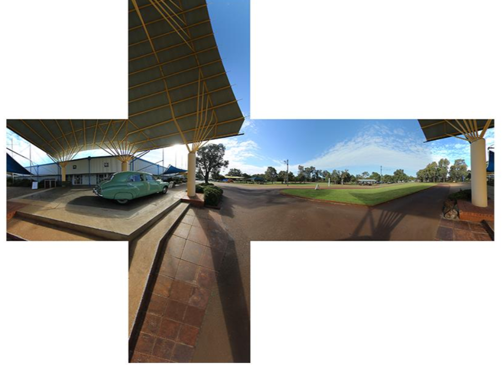

## Transform 3d & Scss & Compass
[코드스피츠](https://www.youtube.com/channel/UCKXBpFPbho1tp-Ntlfc25kA)
채널에서 보고 정리한 글입니다.

---

- Rendering Process
    - 영역 설정 (Geometry == reflow) → 채색 (Fragment == repaint) : Cpu 에서 처리
    - reflow를 하면 전부다 repaint를 하기 때문에 비용이 쎄다.

## Post Process

- 버퍼(Buffer)와 관련 있다. : Gpu에처 처리(Geometry, Fragment 의 버퍼를 이용)
- Post Process 는 Geometry 와 Fragment 와 관련이 없다. (직접 그리지 않는다.)
- post process 부터는 하나의 이미지로써 인식이 된다. (DOM 구조와 상관없다.)



## Transform

- perspective(원근 - 모니터와 눈 사이의 거리)
- perspective-origin

        <!DOCTYPE html>
        <html lang="en">
          <head>
            <meta charset="UTF-8" />
            <title>Title</title>
          </head>
        
          <style>
            @keyframes origin {
              0% {
                perspective-origin: 0% 50%;
              }
              50% {
                perspective-origin: 100% 50%;
              }
              100% {
                perspective-origin: 0% 50%;
              }
            }
        
            @keyframes spin {
              100% {
                transform: rotateX(360deg);
              }
            }
        
            html,
            body {
              height: 100%;
            }
        
            body {
              perspective: 600px;
              background: #404040;
              animation: origin 10s linear infinite;
            }
        
            .test {
              width: 500px;
              height: 500px;
              background: #aaa;
              position: absolute;
              left: 50%;
              top: 50%;
              margin-left: -250px;
              margin-top: -250px;
              animation: spin 30s linear infinite;
            }
          </style>
        
          <body>
            <div class="test"></div>
          </body>
        </html>

    <video controls autoplay loop>
        <source src="./transform.mov" type="video/mp4">
          Your browser does not support the video tag.
    </video>

## Transform 3D

> DOM의 계층구조를 이용하기 위해서는(자식도 부모의 속성에 이어받기) transform-style 을 넘겨 줘야 한다. default 는 flat 이다.
- perspective
- perspective-origin ( 눈을 바라보는 관점)
- transform-style
- transform-origin (변형이 일어 날때의 관점)
- backface-visibility



        <!DOCTYPE html>
        <html lang="en">
          <head>
            <meta charset="UTF-8" />
            <title>Title</title>
          </head>
        
          <style>
            @keyframes spin {
              100% {
                transform: rotateX(360deg);
              }
            }
        
            html,
            body {
              height: 100%;
            }
        
            body {
              perspective: 800px;
              background: #404040;
            }
        
            .test {
              width: 300px;
              height: 300px;
              background: #aaa;
              position: absolute;
              margin-left: -150px;
              margin-top: -150px;
              animation: spin 4s linear infinite;
            }
          </style>
        
          <body>
            <div class="test" style="left: 25%;top:50%;transform-origin: 50% 0%"></div>
            <div class="test" style="left: 50%;top:50%;transform-origin: 50% 50%"></div>
            <div
              class="test"
              style="left: 75%;top:50%;transform-origin: 50% 100%"
            ></div>
          </body>
        </html>

  <video controls autoplay loop>
      <source src="./transform-style.mov" type="video/mp4">
        Your browser does not support the video tag.
  </video>

### Transform 3D 실습

face , splite,  texture 의 덩어리는 mash(입체),Atlas





      <!DOCTYPE html>
      <html lang="en">
        <head>
          <meta charset="UTF-8" />
          <title>Title</title>
        </head>
      
        <style id="style">
          @keyframes spin {
            to {
              transform: rotateX(750deg) rotateY(360deg) rotateZ(360deg);
            }
          }
      
          html,
          body {
            height: 100%;
          }
      
          body {
            perspective: 600px;
            background: #404040;
          }
          .ani {
            animation: spin 4s linear infinite;
          }
          .face {
            background: url('https://keithclark.co.uk/labs/css-fps/drum2.png');
          }
        </style>
      
        <body>
          <script>
            const El = class {
              constructor() {
                this.el = document.createElement('div');
              }
              set class(v) {
                this.el.className = v;
              }
            };
      
            const Face = class extends El {
              constructor(w, h, x, y, z, rx, ry, rz, tx, ty) {
                //tx, ty, tz 는 texture의 x,y,z 좌표 === 한 면(face)
                //rx, ry, rz 는 rotation의 x,y,z
                //w,h 너비, 높이
                super();
                this.el.style.cssText = `
                  position: absolute;
                  width:${w}px;
                  height:${h}px;
                  margin:-${h * 0.5}px 0 0 -${w * 0.5}px;
                  transform:translate3d(${x}px,${y}px,${z}px) rotateX(${rx}rad) rotateY(${ry}rad) rotateZ(${rz}rad);
                  background-position:-${tx}px ${ty}px;
                `;
              }
            };
      
            const Mesh = class extends El {
              constructor(l, t) {
                super();
                this.el.style.cssText = `
                position:absolute;
                  left:${l};
                  top:${t};
                  transform-style: preserve-3d;
                `;
              }
              add(face) {
                this.el.appendChild(face.el);
                return face;
              }
            };
      
            const mesh = new Mesh('50%', '50%');
      
            const r = 100,
              height = 196,
              sides = 20;
            const sideAngle = (Math.PI / sides) * 2;
            const sideLen = r * Math.tan(Math.PI / sides);
      
            for (let c = 0; c < sides; c++) {
              const x = (Math.sin(sideAngle * c) * r) / 2;
              const z = (Math.cos(sideAngle * c) * r) / 2;
              const ry = Math.atan2(x, z);
              const face = new Face(
                sideLen + 1,
                height,
                x,
                0,
                z,
                0,
                ry,
                0,
                sideLen * c,
                0
              );
              face.class = 'face';
              mesh.add(face);
            }
            const _top = new Face(100, 100, 0, -98, 0, Math.PI / 2, 0, 0, 0, 100);
            const _bottom = new Face(100, 100, 0, 98, 0, -Math.PI / 2, 0, 0, 0, 100);
            _top.class = 'face';
            _bottom.class = 'face';
            mesh.add(_top);
            mesh.add(_bottom);
            mesh.class = 'ani';
            document.body.appendChild(mesh.el);
          </script>
        </body>
      </html>

  <video controls autoplay loop>
      <source src="./face.mov" type="video/mp4">
        Your browser does not support the video tag.
  </video>

예제를 보면서 2d의 그림을 수학 공식을 통해 3D 로 변경하였다. 

여기에 사용된 수학 내용은 중학교 의 원의 둘레 구하기 정도 수준이다. 

( 순간적으로 기억이 안나서 수학 공식에 대해 찾아 보았다...)

[수포자가 필요해서 정리하는 수학공식](https://imcts.github.io/math-hodobub/)

[삼각함수 공식 총정리](https://blog.naver.com/PostView.nhn?blogId=dalsapcho&logNo=20131746494)

    const sides = 20; //20조각
    const sideAngle = (Math.PI / sides) * 2;
    //π(pi) = 는 180 도(반원)에 해당하는 값이다.
    
    const r = 100 // 반지름 100
    for (let c = 0; c < sides; c++) {
    	const x = (Math.sin(sideAngle *  c) * r) / 2;
    	const z = (Math.cos(sideAngle * c) * r) / 2;
    	const ry = Math.atan2(x, z);
    }



### Sass + compass로 변경 ex

[Sass 강좌 - 한 눈에 보기](https://velopert.com/1712)

Velopert 님의 Sass를 참고 하면 좋을 것 같다.

- sass 에서는 변수에 @를 붙인다. .
- sass 의 #{} 구문은 #{변수} 변수가 무조건 String 으로 인식한다.
- function 과  mixin과의 차이
    - function 에는 @return directive구문이 있다.
    - mixin 은 css 전부를 리턴해준다.

            $pi: 3.14159265359;
            @function atan2($y, $x) {
              @if $x > 0 {
                @return atan($y / $x);
              }
              @if $x < 0 {
                @if $y >= 0 {
                  @return atan($y / $x) + $pi;
                }
                @if $y < 0 {
                  @return atan($y / $x) - $pi;
                }
              }
              @if $x == 0 {
                @if $y > 0 {
                  @return $pi/2;
                }
                @if $y < 0 {
                  @return -$pi/2;
                }
              }
              @return atan($y/$x);
            }
            
            @mixin face($w, $h, $x, $y, $z, $rx, $ry, $rz, $tx, $ty) {
              position: absolute;
              width: #{$w}px;
              height: #{$h}px;
              margin-top: -#{$h/2}px;
              margin-left: -#{$w/2}px;
              transform: translate3d(#{$x}px, #{$y}px, #{$z}px) rotateX(#{$rx}rad) rotateY(#{$ry}rad) rotateZ(#{$rz}rad);
              background-position: #{$tx}px #{$ty}px;
            }
            
            .mesh {
              position: absolute;
              left: 50%;
              top: 50%;
              transform-style: preserve-3d;
            }
            .mesh > div {
              position: absolute;
              transform-style: preserve-3d;
              background-image: url("http://keithclark.co.uk/labs/css-fps/drum2.png");
              backface-visibility: hidden;
            }
            .mesh > .top {
              @include face(100, 100, 0, -98, 0, $pi/2, 0, 0, 0, 100);
            }
            .mesh > .bottom {
              @include face(100, 100, 0, 98, 0, -$pi/2, 0, 0, 0, 100);
            }
            $r: 100;
            $height: 196;
            $sides: 20;
            $sideAngle: $pi * 2 / $sides;
            $sideLen: $r * tan($pi/$sides);
            $w: $sideLen + 1;
            @for $i from 0 through $sides {
              $x: sin($sideAngle * $i) * $r / 2;
              $z: cos($sideAngle * $i) * $r / 2;
              $ry: atan2($x, $z);
              .mesh > div:nth-child(#{$i}) {
                @include face($w, $height, $x, 0, $z, 0, $ry, 0, -$sideLen * $i, 0);
              }
            }

## Practice

Q. 주어진 큐브맵을 이용해 다음과 같은 화면을 구성하여 Y축으로 회전시키시오

[http://paulbourke.net/miscellaneous/cubemaps/cube.jpg](http://paulbourke.net/miscellaneous/cubemaps/cube.jpg)



  <video controls autoplay loop>
      <source src="./practice.mov" type="video/mp4">
        Your browser does not support the video tag.
  </video>

```
<!DOCTYPE html>
<html lang="en">
  <head>
    <meta charset="UTF-8" />
    <title>Title</title>
  </head>

  <style id="style">
    @keyframes spin {
      to {
        transform: rotateY(360deg);
      }
    }

    html,
    body {
      height: 100%;
    }

    body {
      perspective: 600px;
      background: #404040;
      overflow: hidden;
    }
    .ani {
      animation: spin 20s linear infinite;
    }
    .face {
      background: url('http://paulbourke.net/miscellaneous/cubemaps/cube.jpg');
      backface-visibility: hidden;
    }
  </style>

  <body>
    <script>
      const El = class {
        constructor() {
          this.el = document.createElement('div');
        }
        set class(v) {
          this.el.className = v;
        }
      };

      const Face = class extends El {
        constructor(w, h, x, y, z, rx, ry, rz, tx, ty) {
          //tx, ty, tz 는 texture의 x,y,z 좌표 === 한 면(face)
          //rx, ry, rz 는 rotation의 x,y,z
          //w,h 너비, 높이
          super();
          this.el.style.cssText = `
            position: absolute;
            width:${w}px;
            height:${h}px;
            margin:-${50}px 0 0 -${500}px;
            transform:translate3d(${x}px,${y}px,${z}px) rotateX(${rx}deg) rotateY(${ry}deg) rotateZ(${rz}deg);
            background-position:-${tx}px ${ty}px;
            
          `;
        }
      };

      const Mesh = class extends El {
        constructor(l, t) {
          super();
          this.el.style.cssText = `
          position:absolute;
            left:${l};
            right:${t};
            transform-style: preserve-3d;
          `;
        }
        add(face) {
          this.el.appendChild(face.el);
          return face;
        }
      };

      const mesh = new Mesh('50%', '50%');

      const r = 1000,
        height = 1000,
        sides = 4;
      const sideAngle = (Math.PI / sides) * 2;
      const sideLen = r * Math.tan(Math.PI / sides);

      let deg = 90;
      for (let c = 0; c < sides; c++) {
        const x = ((Math.cos(sideAngle * c) * r) / 2) * -1;
        const z = ((Math.sin(sideAngle * c) * r) / 2) * -1;
        // const ry = (180 / Math.PI) * parseInt(Math.atan2(x, z));
        const ry = deg;
        deg -= 90;
        const face = new Face(
          sideLen,
          height,
          x,
          0,
          z,
          0,
          ry,
          0,
          sideLen * c,
          -1000
        );
        face.class = 'face';
        mesh.add(face);
      }
      const _top = new Face(1000, 1000, 0, -500, 0, -90, 0, 0, 1000, 0);
      const _bottom = new Face(1000, 1000, 0, 500, 0, 90, 0, 0, 1000, -2000);
      _top.class = 'face';
      _bottom.class = 'face';
      mesh.add(_top);
      mesh.add(_bottom);
      mesh.class = 'ani';
      document.body.appendChild(mesh.el);
    </script>

  </body>
</html>
```

혹은 css 버전

```
<!DOCTYPE html>
<html lang="en">
  <head>
    <meta charset="UTF-8" />
    <title>Title</title>
  </head>

  <style id="style">
    @keyframes spin {
      to {
        transform: rotateY(360deg);
      }
    }

    html,
    body {
      height: 100%;
    }

    body {
      perspective: 600px;
      background: #404040;
      overflow: hidden;
    }
    .env {
      animation: spin 20s linear infinite;
      position: absolute;
      left: 50%;
      right: 50%;
      transform-style: preserve-3d;
    }
    .env > div {
      background: url('http://paulbourke.net/miscellaneous/cubemaps/cube.jpg');
      position: absolute;
      margin: -50px 0 0 -500px;
      width: 1000px;
      height: 1000px;

      backface-visibility: hidden;
    }
  </style>

  <body>
    <div class="env">
      <div
        class="left"
        style="transform:translate3d(-500px,0,0)  rotateY(90deg) ;background-position:0 -1000px;"
      ></div>
      <div
        class="back"
        style="transform:translate3d(0,0,-500px) ;background-position:-1000px -1000px;"
      ></div>
      <div
        class="right"
        style="transform:translate3d(500px,0,0)  rotateY(-90deg) ;background-position:-2000px -1000px;"
      ></div>
      <div
        class="front"
        style="transform:translate3d(0,0,500px)  rotateY(180deg) ; background-position:-3000px -1000px;"
      ></div>
      <div
        class="top"
        style="transform:translate3d(0,-500px,0) rotateX(-90deg) ;background-position:-1000px 0"
      ></div>
      <div
        class="botton"
        style="transform:translate3d(0,500px,0) rotateX(90deg) ;background-position:-1000px -2000px"
      ></div>
    </div>
  </body>
</html>
```
