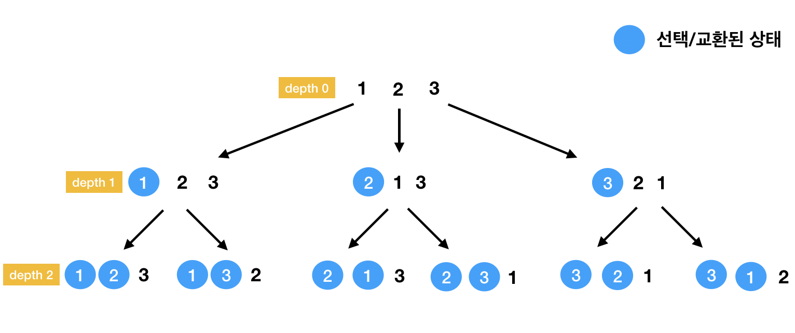

# [JAVA]-순열(Permutation)

## TMI

[[온라인 스터디] 코딩테스트와 실무 역량 모두 잡는 알고리즘 스터디(Java) 2기 | 프로그래머스](https://programmers.co.kr/learn/courses/10004)

시작부터 TMI 가 시작된다. 프로그래머스에서 진행하는 코딩테스트-JAVA 를 온라인 스터디 진행하면서 배운 내용을 정리 한다.

[알고리즘 연습 - 소수 만들기 | 프로그래머스](https://school.programmers.co.kr/courses/10022/lessons/58131)

내가 풀었던 문제 중 소수 만들기 문제를 풀면서 조합을 만들기 위해 Picker 클래스를 만들게 되었다. Picker 클래스를 만들면서 조합과 순열을 만드는 방법이 크게 다르지 않아 이번에는 순열을 만들어 주는 Permutation 클래스를 만들어 보았다.

## n개중 r개를 선택하여 순열 만들기

> 예시

- int[] numbers = {1,2,3};
- 집합에서 2개의 순열을 구하는 경우
- [[1, 2], [1, 3], [2,1], [2,3], [3,2], [3,1]]

- 집합에서 3(모든)개의 순열을 구하는 경우

    [[1, 2,3], [1, 3,2], [2,1,3], [2,3,1], [3,2,1], [3,1,2]]가 될것이다.

    
    > 순열을 만드는 방법은 선택할 (앞에서 순차적인)인덱스와 교환될 인덱스를 선택하여 교환(switch)하는 과정을 반복적으로 실행하여 순열을 만들어 낼 수 있다. 순열은 depth level === [선택된/ 고정된]index 와 동일하다.

## 소스코드 (Permutation 클래스 설명)

- 필드

        private T[] array; //제네릭 타입
        private List<T[]> selectedPermutationList; // 반환할 리스트
        //ex) [[1, 2], [1, 3], [2,1], [2,3], [3,2], [3,1]]

- getSelectedList()

        List<T[]> getSelectedPermutationList(int selecteCount) {
            doPermutation(Arrays.copyOf(array, array.length), 0, selecteCount);
            return selectedPermutationList;
        }

    - 순열 리스트를 반환하는 메소드
    - `int selecteCount` 를 입력 받아 몇 개 선택할지 인자로 받는다.
    - doPermutation() 를 실행하여 순열을 만든다.
- doPermutation()

        private void doPermutation(T[] values, int depth, int selecteCount) {
            final int arrayLength = values.length;
        
            if (depth == selecteCount) {
                addSelectedValueList(Arrays.copyOf(values, selecteCount));
                return;
            }
            for (int index = depth; index < arrayLength; index++) {
                T[] swapedArray = getSwapedArray(values, index, depth);
                doPermutation(swapedArray, depth + 1, selecteCount);
            }
        }

    - `if (depth == selecteCount)` 반환 조건 (선택한 갯수 === depth level)
    - `int depth` 는 선택된 index 와 같다.

### 전체 소스코드

    class Permutation<T> {
          private T[] array;
          private List<T[]> selectedPermutationList;
    
          Permutation(T[] array) {
              this.array = array;
              selectedPermutationList = new ArrayList<>();
          }
    
          List<T[]> getSelectedPermutationList(int selecteCount) {
              doPermutation(Arrays.copyOf(array, array.length), 0, selecteCount);
              return selectedPermutationList;
          }
    
          private void addSelectedValueList(T[] values) {
              selectedPermutationList.add(values);
          }
    
          private void doPermutation(T[] values, int depth, int selecteCount) {
              final int arrayLength = values.length;
    
              if (depth == selecteCount) {
                  addSelectedValueList(Arrays.copyOf(values, selecteCount));
                  return;
              }
              for (int index = depth; index < arrayLength; index++) {
                  T[] swapedArray = getSwapedArray(values, index, depth);
                  doPermutation(swapedArray, depth + 1, selecteCount);
              }
          }
    
          T[] getSwapedArray(T[] arr, int depthIndex, int indexToExchanged) {
              T temp = arr[depthIndex];
              arr[depthIndex] = arr[indexToExchanged];
              arr[indexToExchanged] = temp;
              return Arrays.copyOf(arr, arr.length);
          }
      }

### Permutation 클래스 사용법

    int[] nums = {1, 2, 3};
    Integer[] values = Arrays.stream(nums).boxed().toArray(Integer[]::new);
    
    List<Integer[]> combinationNumberList = new Permutation(values).getSelectedPermutationList(2);
    for (Integer[] arr : combinationNumberList) {
        System.out.println(Arrays.toString(arr));
    }

## PS

- 지난번 Picker 클래스의 getSelectedCombinationList()의 리턴타입은 Set in List 타입이었다. 이후에는 array in List 타입으로 추천을 했었기 때문에 Permutation 클래스의 getSelectedPermutationList() 의 리턴타입은 array in List 타입으로 변경해 보았다.
- 순열과 조합을 만드는 과정은 매우 유사해 보인다. 코드를 더 줄일 수도 있지만 개인적으로(머리가 좋지 않아서ㅠㅠ) 이러한 코드가 실행 과정이 더 잘 보이는 것 같다.
- 다음번엔 Map 클래스에 대해 공부할 예정이다. (..여러 구현체가 있었군..)
- 공부한 내용을 정리 해야되는데...열심히 해야겠다..(#정리짤 #평화 #깔끔)

    

---

참고 사이트

[순열(Permutation) 알고리즘](https://gorakgarak.tistory.com/522)