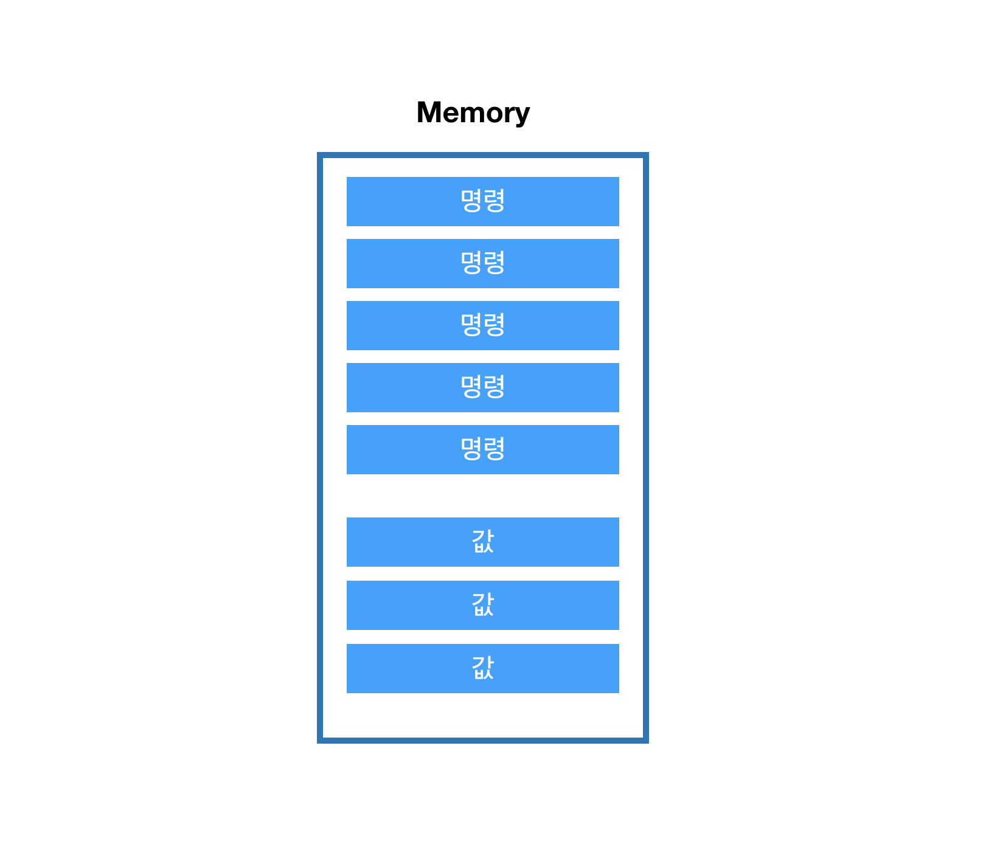
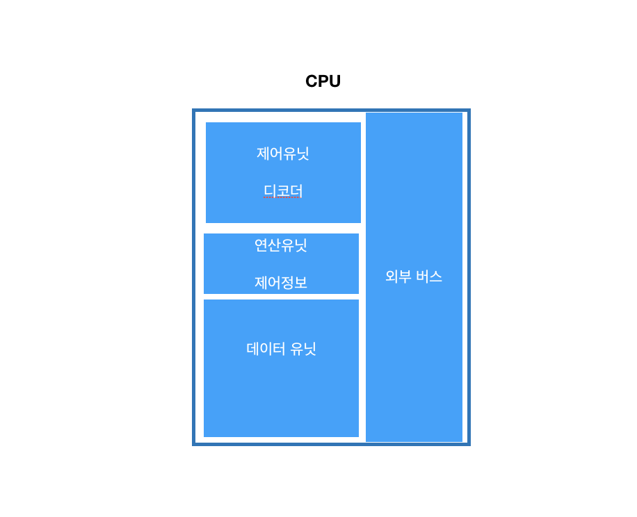
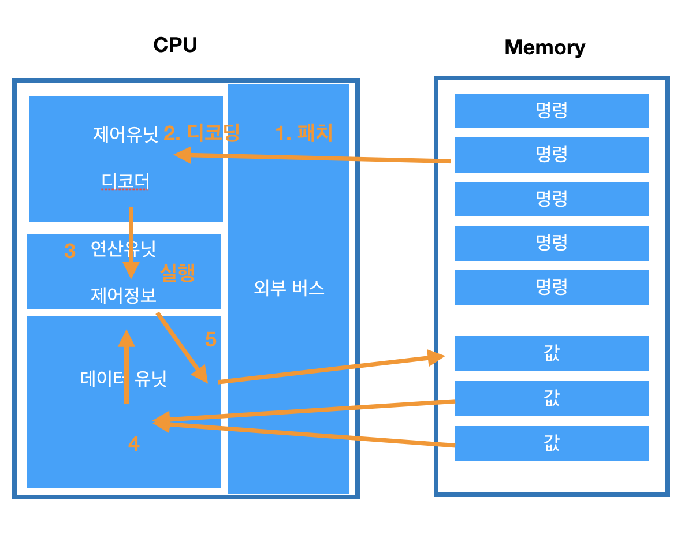
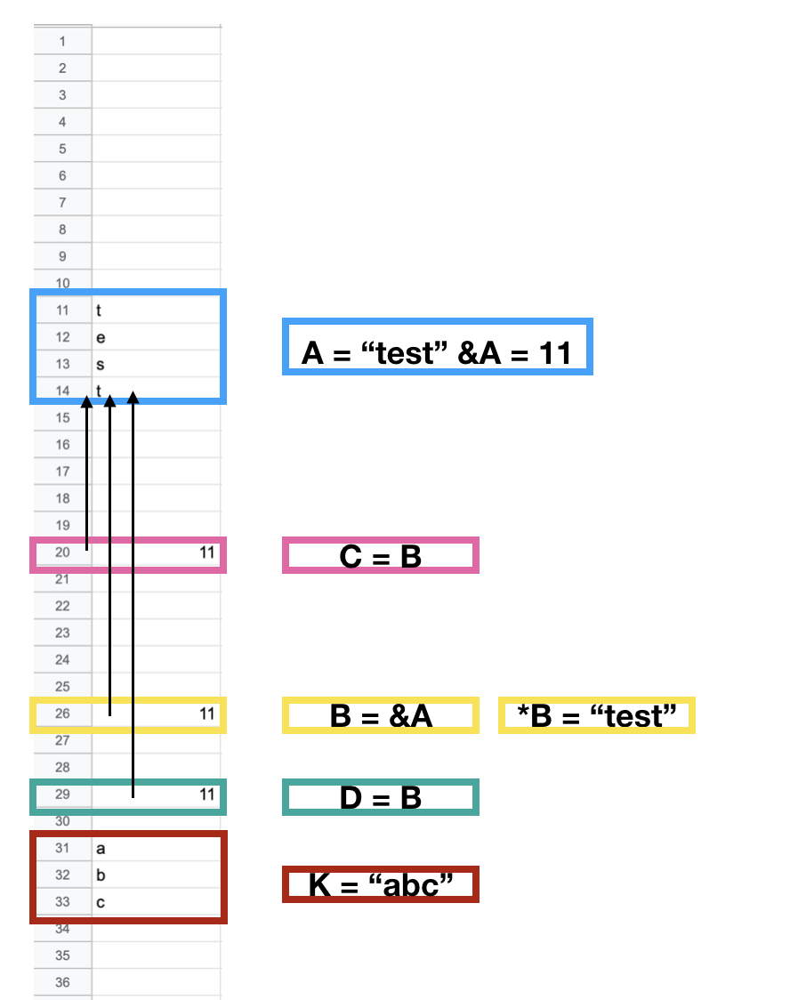
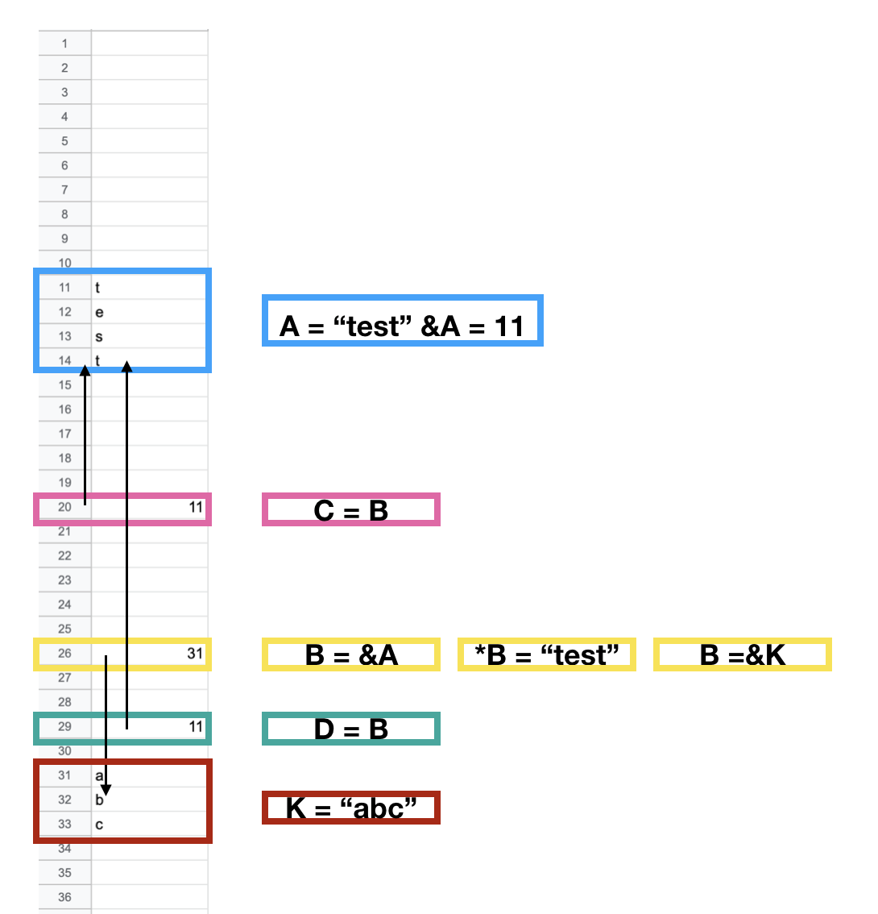
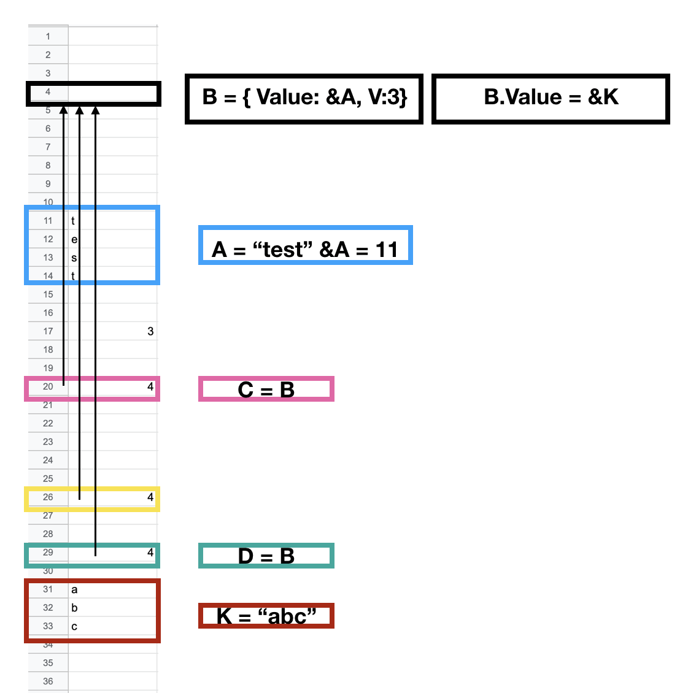

## programming & javascript elementry
[코드스피츠](https://www.youtube.com/channel/UCKXBpFPbho1tp-Ntlfc25kA)

채널에서 보고 정리한 글입니다.

---

프로그래밍 언어 기본 틀과 자바스크립트 언어의 기본 요소를 살펴봅니다.

## why did you do that?

철학 - 합리주의, 상대주의 (부모는 무조건 부모인가? 누구의 자식이지 않는가?)

- 켄트백

- 가치
    - 의사소통
    - 단순함
    - 유연함
- 원칙
    - 지역화
    - 중복제거
    - 대칭성
- 패턴
    - 개발론
    - 설계론
    - 각종적용패턴
- 동기
    - 돈
    - 시간

## program & timing

### Compile program

1. language code (c,java, javascript == text file)
    1. Lint Time(시점)
2. machine language (compile된 컴퓨터 언어, text file 일수도 있다.)

    2. Compile Time(시점)

3. file
4. load - load영역 까지 프로그래머가 통제하는 영역이다.
5. run
    1. Run Time(시점)
    2. Run Time Error 에도 안 걸리는 논리적인 오류를 context error 라고 한다.
6. terminate

### script program

1. language code (c,java, javascript == text file)
    1. Lint Time(시점)
2. file
3. load - load영역 까지 프로그래머가 통제하는 영역이다.
4. machine language (메모리 내부에서 변경된다. 매번 만들 수 도 있다.)

    2. Compile Time(시점)

5. run
    1. Run Time(시점)
    2. Run Time Error 에도 안 걸리는 논리적인 오류를 context error 라고 한다.
6. terminate

## Runtime

script program을 잘 이해하기 위해서 Runtime 에 대해 잘 알아야 한다. 

### Compile program runtime

runtime 은 메모리에 로드 하고 적재하는 시점이다.

1. Loding

    

2. Instruction Fetch & Decoding

    Fetch: 외부 버스에서 Memory 의 명령어를 가져온다.

    Instruction : cpu가 해석할 수 있는 명령어

    디코더는 memoery의 추상 명령어를 cpu의 명령어로 Decoding 한다.

    

3. execution

파일을 메모리 적재하고 ,적재된 명령들을 순차적으로 실행하면 종료된다.

Loding → { Instruction Fetch & Decoding → execution → } → terminate

1. essential definition loading (가장 중요한 정의 로딩)
2. vtable mapping (코드의 변수들이 활성화 되는 부분이다.)
3. run
4. runtime definition loading (ex) 클릭을 했을 때 함수 생성)
5. run

### script program runtime

Run

- declare base function, class...

static time (상대적으로 static)

---

run time

- declare extended function, class...

static time (상대적으로 static)

---

run time

- use function, class...

여기 까지가 프로그램 생명주기

---

## 프로그램 작동 방식

memory, address, pointer, variables, dispatch

- 프로그램의 유연성을 위해 참조를 사용 하는데, 왜 참조의 참조를 사용하는지 알아야 한다.

메모리 주소의 블록은 컴퓨터 환경마다 다르다 (32bit, 64bit)

32bit 의 최대의 메모리는 가질 수 있 는 크기는 4G 이다.

### 메모리 상황 알아 보기

> ( 직접 참조) b 의 배신 알아 보기

- &A 의 &는 c언어의 주소 연산자, 즉 메모리 주소를 반환하는 연산자 이다.

    A의 메모리 주소는 11번이라는 것을 알 수 있다.

- *B 의 * 는 포인트 긴잡 참조 연산자, 즉 메모리 번지의 값을 반환 하는 연산자 이다.

    B의 값이 있는 주소, 즉 B의 값 11인 의 주소 번지의 값을 반환 한다. == test

- B의 참조 값을 변경 했을 경우

    실행 상 문제가 되지 않는다. 하지만 남은 코드를 보았을 때 C, D 는 B의 값을 참조 한 것으로 보이지만, B는 배신을 하여 최초의 A가 아닌 K 를 참조하게 된다. 

**이러한 직접 참조의 문제 (배신의 문제) 를 해결하기 위해서는 *더블 디스패치*를 이용한다.**

B의 참조 가 변경 되더라도 남은 코드를 봤을 때, 직접 참조보다 추측하기 쉬워진다.

- 참조의 참조 == 더블 디스패치 (링크드 리스트의 구조와 같다고 본다)
- 객체지향에서는 인터페이스와 같다. (커플링을 제거한다고 본다.)

---

여기 부터 javascript basic

## lexical grammar

- control character 제어문자
- white space 공백문자
- line terminators 개행문자
- comments 주석
- keyword 예약어
- literals 리터럴
    - 더이상 나눌 수 없는 객체의 값, 값의 표현
    - ex) 숫자 37, 0.5, .5 등등

## language element

- statements 문
    - 공문, 식문, 제어문, 선언문
    - 단문, 중문
    - 공문 ex) for(let i=0; i<5; i++); 이것도 인정해준다.
    - 단문 ex) if(true) let i = 5;
    - 중문 ex) if(true) { let i =5; j=6;}
- expression 식
    - 값식, 연산식, 호출식
- identifier 식별자
    - 기본형, 참조형
    - 변수, 상수