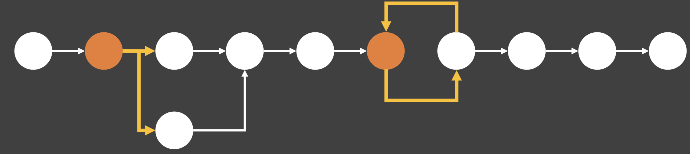
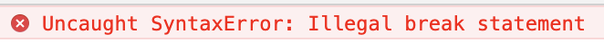
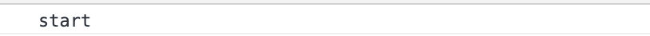
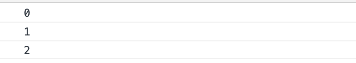

## flow control statement
[코드스피츠](https://www.youtube.com/channel/UCKXBpFPbho1tp-Ntlfc25kA)

채널에서 보고 정리한 글입니다.

---

## record, completion record

- js 식 처리 방식
    - 식은 하나 의 값으로 해석:
- js 문처리 방식
    - 하나의 실행 단위로 해석; ex)10개의 문, 10개의 줄은 10개의 실행한위

        **statement - record**

        flow control statement

        completion record 

        (flow를 선택할수 있는 문, 어떤 record를 선택할지)

        

    ## Direct flow control

    B언어 까지 직접 flow control을 사용하였다.

    C언어가 오고나서야 전용 flow control 이 생겼다. 

    ## Label

    js 에서의 직접 flow control. ex) while의 break;

        var i, j;
        
        loop1:
        for (i = 0; i < 3; i++) {      //첫번째 for문은 "loop1" 레이블을 붙였다.
           loop2:
           for (j = 0; j < 3; j++) {   //두번째 for문은 "loop2" 레이블을 붙였다.
              if (i === 1 && j === 1) {
                 continue loop1;
              }
              console.log('i = ' + i + ', j = ' + j);
           }
        }

    break나 continue 구문과 함께 사용할 수 있다. 원하는 식별자로 구문 앞에 레이블을 추가할 수 있다.

    - identifier

        label은 공문이라도 있어야 된다 하나의 문이 아니다.

            label : 
            		statement

            <!DOCTYPE html>
            <html lang="en">
              <head>
                <title>Document</title>
              </head>
              <body>
                
              </body>
            </html>

    - scope
        - static parsing

        같은 범위를 지정 할 수 없다. 파싱 단계에서 막아 준다.

            <!DOCTYPE html>
                <html lang="en">
                  <head>
                    <title>Document</title>
                  </head>
                  <body>
                    
                  </body>
                </html>

        label scope 를 만들면 영역을 나눌 수 있다. 중문 이랑 생김 새는 비슷하지만 다른다.

            abc: {
            	abc:3;
            }

        - label shadow

            <!DOCTYPE html>
            <html lang="en">
              <head>
                <title>Document</title>
              </head>
              <body>
                
              </body>
            </html>

        

            

        

    - label range & set
        - 다음 레이블 까지가 지정이 안되어 있으면 다음 label 까지  label range 가 된다.

            <!DOCTYPE html>
            <html lang="en">
              <head>
                <title>Document</title>
              </head>
              <body>
                
              </body>
            </html>

        break abc 는 label 의 마지막 블록으로 보내진다.

        

        다음 과 같은 경우 지정이 있을 경우 label rabge는 해당 범위 까지 지정된다.

        - auto label
        - iteration, switch
        undefined named label
    - as comment

    ## switch

    - special label block
    - fall through
        - 각 case 마다 break 를 안 걸면 fall through (다른 케이스도 실행되는 현상)

                

    - auto label
        - 각 case 마다 break 를  걸면 switch 앞에 auto label 을 생성한다.

                

    - runtime switch

        default label의 처리 순서는 언어마다 다르다. (컴파일 방식, 인터프리터 방식)

        - (정적인 경우)값에 대한 라우팅

            case에  값에 대한 평가는 꼭 정적으로 할 필요는 없다 동적으로 해도 된다.

                

        - 조건 분기에 대한 라우팅

            연쇄되어 있는 책임 분기 의 상황에서 사용한다. (조건을 무력화 시킨다. == 통일한다.)

                

    - reverse case

    ## if, if else

    else 는 후방결합 특성이 있다.

    if, else if 중첩이나 복잡한 사용은 else의 후방결합을 완전히 이해하지 않으면 버그로 이어 진다. 이제 부터 else if 사용을 금지한다.

    else if 는 병행 조건에 사용 되는 것이 아니다.

    (switch 를 이용해야 한다.)

        a:count c =3;
        if(c === 1){
        
        } else if(c === 2){ //위험한 코드이다.
        
        } else{
        	
        }

        a:count c =3;
        if(c === 1){
        
        } else {
        	if(c === 2){
        
        	} else{
        	
        	}
        }

    단일 if 문은 optional 하다.

    if, else 문은 mandatory (필수적) 이다.

    if, else if, else 는 nested 일 경우에 사용한다.

    switch 는 parallel 일 경우에 사용한다.

    ## iterate flow control

    ## for

        for(ex;ex;ex;){
        //1번째는 선언문 이거나 식이 올수 있다. 
        //2번째는 truthy 값일 때만
        }

    1. 1번째는 선언문 이거나 식이 올수 있다. 

        원래는 식만 있어야 하지만 for 문의 예외 상황이다.

        식은 값으로 떨어진다.

        var 가 들어 가있는 건 문이다. 

            var a = 3;
            var k = var a =3; // 오류, 식은 값으로 떨어진다. 이는 문이다.

    2. 2번째는 truthy 값일 때만

        falsy 값(거짓 계열들의 값) 

        - '', false, 0, undifined, nulll, NaN

        truthy 는 falsy 값이 아닌 것

    3. 식문이기에 공문으로 둘수 있다.

            for(;;;){
            //상식적으로 2번째 식은 falsy값이기 때문에 안돌것 같지만
            //예외적으로 for 문의 2번째 식은 공문으로 truthy 로 처리한다.
            }

    limited statement empty truthy last execution

    ## while, do while

    Infinite loop(ex in body)

    조건식이 나오는 내용이 body 에 나오는 것인지 확인하는 것이 관건이다.

        var a= -1;
        while(a > 2){
        	a++;
        }
        do {
        
        } while(truthy)