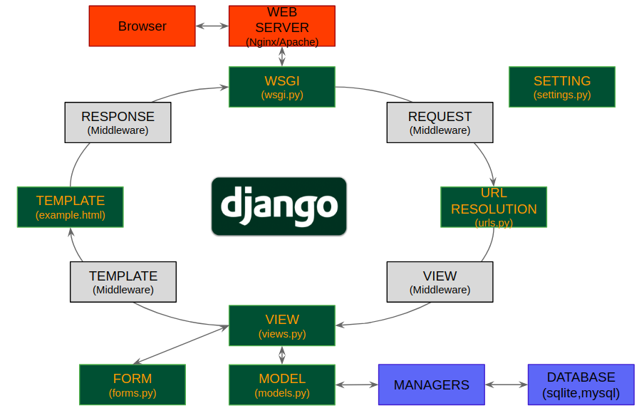
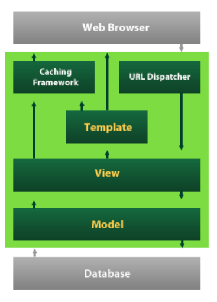

Django는 무엇이고 어떻게 동작하는지 알아봅시다.

Django는 현재 가장 많이 사용되는 파이썬 웹 프레임워크입니다.
2003년 로렌스 저널-월드 신문을 만들던 웹 개발팀의 내부 프로젝트로 시작됐으며, 오픈소스 프로젝트로
공개되었습니. 그리고 구글의 앱 엔진에서 장고를 사용하면서 많은 사람들이 사용하게 되었고, 현재는
파이썬의 대표적인 웹 프레임워크로 자리매김하고 있습니다.

장고는 MVC를 기반으로 한 프레임 워크입니다. 장고에서는 View를 Template, Controller를 view라고 부릅니다.

View는 데이터를 가져오고 변형하는 컴포넌트, Template는 데이터를 사용자에게 보여주는 컴포넌트입니다.
그래서 장고를 흔히 MTV 프레임워크라고 부르기도합니다.

- Model
    안전하게 데이터를 저장
- View
    데이터를 적절하게 유저에게 보여줌
    = 데이터를 유저에게 보내줄 때 유저가 원하는 형태로 형태로 보내주는 것을 담당
- Control, Template(Django)
    사용자의 입력과 이벤트에 반응하여 Model과 View를 업데이트(수정)

## Django 개념
###  장고의 workflow

1. 웹 브라우저에서 이벤트가 발생 (url을 클릭하거나, 어떤 form에 data를 입력 등)

2. 장고 서버로 data가 들어오고 'url dispatcher'에서 user가 요청한 url을 분석하고
    그에 적합한 view로 보내준다.
3. view는 사용자의 요청을 받아서, DB 어디에 접근해서, 어떤 데이터를 가공해야할 지 모델에 알려주면
4. 모델에서 실질적인 DB와 커넥션을 하고 데이터를 가져오게 된다.
5. DB에서 모델에 다시 데이터를 보내고
6. 모델이 뷰에 데이터를 보내주고 뷰가 실질적으로 user에게 보여줄 데이터를 템플릿에 전송
7. 템플릿은 ui를 만들어서 웹브라우저에 넘겨주게 된다.

*이렇게 복잡한 과정들이 있는 것은 특정 영역을 분리하는게 중요하기 때문!*

## project와 App

프로젝트 = 웹 사이트
의미있는 하나의 기능을 app이라고 구성

    $ django-admin startprojec (project name)

이렇게 명령어를 입력하면

    manage.py(실행파일)
    project name(디렉토리)
        __init__.py
        settings.py(전체 프로젝트를 관리하는 설정파일)
        urls.py
        wsgi.py

위와 같이 파일 구조가 생깁니다.

app 생성(상위에)

    $ ./manage.py startapp (app name)

다양한 파일 목록이 생깁니다.

    app name
        admin.py(관리자권한을 가지는 사용자가 볼 수 있는 페이지에 대한 내용을 다룸)
        __init__.py
        migrations
            __init__.py
        models.py
        tests.py
        views.py(데이터를 가공)

### Settings.py

전체적인 프로젝트 환경 설정 파일

`debug`
에러에 대한 내용을 보고 싶을때 true로 두게 되면 변수의 상태를 확인 할 수 있습니다.
배포를 할 때는 false(디버깅 내용을 공개하지 않기 위해서), 개발단계에서는 true

`installed_apps`
    pip로 설치한 앱 또는 본인이 만든 app를 추가

`middelware_classes`
request와 response 사이의 주요 기능 레이어(크게 신경 쓸 필요 없음 - 보안 기능)
`templates`
django template관련 설정, 실제 뷰(html, 변수)에서 컨트롤해서 다루게 됩니다.
`databases`
데이터베이스 설정 파일, 데이터베이스 엔진의 연결 설정(다양한 데이터베이스를 사용할 수 있음)
`static_url`
정적파일(js,img,css)들과 관련된 url이나 dict가 관련된 설정파일

### Manage.py
프로젝트 관리 명령어 모음

`startapp`: 앱생성
`runserver`: 서버 실행
`createsuperuser`: 관리자 실행
`makemigrations app`: app의 모델 변경 사항 체크
`migrate`: 변경 사항을 DB에 반영
`shell`: 쉘을 통해 데이터를 확인
`collectstatic`: static 파일을 한 곳에 모음

    ex) ./manage.py runserver 0.0.0.0:8080

---

ref : https://www.essenceandartifact.com/2012/12/the-essence-of-mvc.html
